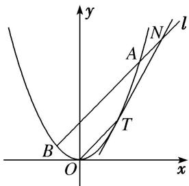

<!-- question-source:start -->
[例8] 在平面直角坐标系 $xOy$ 中，点 $F$ 的坐标为 $\left(0, \frac{1}{2}\right)$ ，以线段 $MF$ 为直径的圆与 $x$ 轴相切.

(1)求点 M 的轨迹 E 的方程;

(2)设 $T$ 是 $E$ 上横坐标为2的点， $OT$ 的平行线 $l$ 交 $E$ 于 $A$ ， $B$ 两点，交曲线 $E$ 在 $T$ 处的切线于点 $N$ ，求证： $|NT|^2 = \frac{5}{2} |NA| \cdot |NB|$ .

[规范解答]
(1)设点 $M(x,y)$ ，因为 $F\left(0,\frac{1}{2}\right)$ ，所以 $MF$ 的中点坐标为 $\left(\frac{x}{2},\frac{2y + 1}{4}\right)$ .

因为以线段 $MF$ 为直径的圆与 $x$ 轴相切，所以 $\frac{|MF|}{2} = \frac{|2y + 1|}{4}$ ，即 $|MF| = \frac{|2y + 1|}{2}$

故 $\sqrt{x^{2}+\left(y-\frac{1}{2}\right)^{2}}=\frac{|2y+1|}{2}$ ，得 $x^{2}=2y$ ，所以 M 的轨迹 E 的方程为 $x^{2}=2y$ .

(2)证明：因为 T 是 E 上横坐标为 2 的点，所以由
(1)得 $T(2, 2)$ ，所以直线 OT 的斜率为 1。因为 $l \parallel OT$ ，所以可设直线 l 的方程为 $y = x + m, m \neq 0$ 。

由 $y=\frac{1}{2}x^{2}$ ，得 $y'=x$ ，则曲线 E 在 T 处的切线的斜率为 $y'\big|_{x=2}=2$ ，

所以曲线 E 在 T 处的切线方程为 y=2x-2.

由 $\left\{\begin{aligned}y&=x+m,\\ y&=2x-2,\end{aligned}\right.$ 得 $\left\{\begin{aligned}x=m+2,\\ y&=2m+2,\end{aligned}\right.$

所以 $N(m+2, 2m+2)$ ，所以 $|NT|^{2}=[(m+2)-2]^{2}+[(2m+2)-2]^{2}=5m^{2}$ .

由 $\left\{\begin{aligned}y=x+m,\\ x^{2}=2y\end{aligned}\right.$ 消去 y，得 $x^{2}-2x-2m=0$ ，由 $\Delta=4+8m>0$ ，解得 $m>-\frac{1}{2}$ .

设 $A(x_{1}, y_{1})$ ， $B(x_{2}, y_{2})$ ，则 $x_{1} + x_{2} = 2$ ， $x_{1}x_{2} = -2m$ .

因为 N, A, B 在 l 上，所以 $\left|NA\right|=\sqrt{2}\left|x_{1}-(m+2)\right|$ ， $\left|NB\right|=\sqrt{2}\left|x_{2}-(m+2)\right|$ ,

所以 $|NA|\cdot|NB|=2|x_{1}-(m+2)|\cdot|x_{2}-(m+2)=2|x_{1}x_{2}-(m+2)(x_{1}+x_{2})+(m+2)^{2}|$ $=2|-2m-2(m+2)+(m+2)^{2}|=2m^{2}$ ,

所以 $|NT|^{2}=\frac{5}{2}|NA|\cdot|NB|$ .
<!-- question-source:end -->
