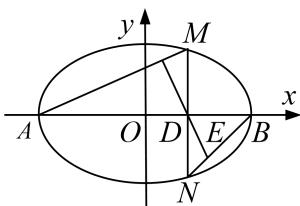

<!-- question-source:start -->
[例 9] (2017·北京)已知椭圆 C 的两个顶点分别为 $A(-2, 0)$ ， $B(2, 0)$ ，焦点在 x 轴上，离心率为 $\frac{\sqrt{3}}{2}$ .

(1)求椭圆 C 的方程;

(2)点 $D$ 为 $x$ 轴上一点，过 $D$ 作 $x$ 轴的垂线交椭圆 $C$ 于不同的两点 $M, N$ ，过 $D$ 作 $AM$ 的垂线交 $BN$ 于点 $E$ 。求证： $\triangle BDE$ 与 $\triangle BDN$ 的面积之比为 $4:5$ 。

[规范解答]
<!-- question-source:end -->

![[高中/总复习/专题/圆锥曲线/专题30  证明数量关系型问题-圆锥曲线/专题30__证明数量关系型问题/例题/answers/Q00042673A1.md]]
