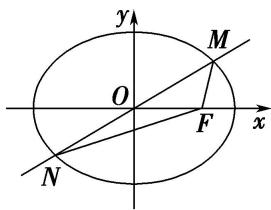
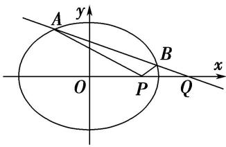

<!-- question-source:start -->
2. 如图，已知椭圆 $C: \frac{x^2}{a^2} + \frac{y^2}{b^2} = 1 (a > b > 0)$ 的右焦点为 $F$ ，点 $\left(-1, \frac{\sqrt{3}}{2}\right)$ 在椭圆 $C$ 上，过原点 $O$ 的直线与椭圆 $C$ 相交于 $M$ ， $N$ 两点，且 $|MF| + |NF| = 4$ .

  
图①

  
图②
<!-- question-source:end -->

![[高中/总复习/专题/圆锥曲线/专题30  证明数量关系型问题-圆锥曲线/专题30__证明数量关系型问题/对点训练/answers/Q00042676A1.md]]
