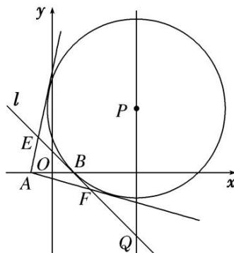

<!-- question-source:start -->
4. 如图， $P$ 是直线 $x = 4$ 上一动点，以 $P$ 为圆心的圆 $\Gamma$ 过定点 $B(1,0)$ ，直线 $l$ 是圆 $\Gamma$ 在点 $B$ 处的切线，过 $A(-1,0)$ 作圆 $\Gamma$ 的两条切线分别与 $l$ 交于 $E$ ， $F$ 两点.

(1)求证： $|EA|+|EB|$ 为定值；

(2)设直线 l 交直线 x=4 于点 Q，证明： $|EB|\cdot|FQ|=|FB|\cdot|EQ|$ .

<!-- question-source:end -->

![[高中/总复习/专题/圆锥曲线/专题30  证明数量关系型问题-圆锥曲线/专题30__证明数量关系型问题/对点训练/answers/Q00042678A1.md]]
