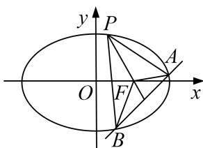

<!-- question-source:start -->
5. 已知斜率为 $k$ 的直线 $l$ 与椭圆 $C: \frac{x^2}{4} + \frac{y^2}{3} = 1$ 交于 $A, B$ 两点．线段 $AB$ 的中点为 $M(1, m) (m > 0)$ .

(1)证明： $k<-\frac{1}{2};$

(2)设 $F$ 为 $C$ 的右焦点， $P$ 为 $C$ 上一点，且 $\overrightarrow{FP} + \overrightarrow{FA} + \overrightarrow{FB} = 0$ 。证明： $2|\overrightarrow{FP}| = |\overrightarrow{FA}| + |\overrightarrow{FB}|$ .

<!-- question-source:end -->

![[高中/总复习/专题/圆锥曲线/专题30  证明数量关系型问题-圆锥曲线/专题30__证明数量关系型问题/对点训练/answers/Q00042679A1.md]]
