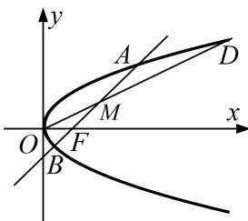

<!-- question-source:start -->
9. 已知抛物线 $C: y^{2} = 2px (p > 0)$ , 焦点为 $F$ , $O$ 为坐标原点, 直线 $AB$ (不垂直于 $x$ 轴) 过点 $F$ 且与抛物线 $C$ 交于 $A$ , $B$ 两点, 直线 $OA$ 与 $OB$ 的斜率之积为 $-p$ .

(1)求抛物线 C 的方程;

(2)若 $M$ 为线段 $AB$ 的中点，射线 $OM$ 交抛物线 $C$ 于点 $D$ ，求证： $\frac{|OD|}{|OM|} >2.$

<!-- question-source:end -->

![[高中/总复习/专题/圆锥曲线/专题30  证明数量关系型问题-圆锥曲线/专题30__证明数量关系型问题/对点训练/answers/Q00042683A1.md]]
