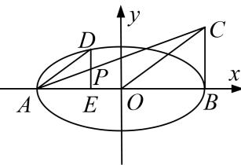

> [!faq]- 《专题30  证明数量关系型问题(教师版)》例题解析
>
> > [!success]- **【答案】** 详见解析
>
> > [!note]- **【解析】**
> > (1)求椭圆 $C_{1}$ 的方程;
> >
> > (2)设椭圆 $C_1$ 的左、右顶点分别为 $A, B$ , 过椭圆 $C_1$ 上的一点 $D$ 作 $x$ 轴的垂线交 $x$ 轴于点 $E$ , 若点 $C$ 满足 $\overrightarrow{AB} \perp \overrightarrow{BC}$ , $\overrightarrow{AD} // \overrightarrow{OC}$ , 连接 $AC$ 交 $DE$ 于点 $P$ , 求证: $PD = PE$ .
> >
> > 
> >
> > 3. 解析
> > (1)由 $e = \frac{\sqrt{3}}{2}$ ，知 $\frac{c}{a} = \frac{\sqrt{3}}{2}$ ，所以 $c = \frac{\sqrt{3}}{2} a$ ，因为 $\triangle MF_1F_2$ 的周长是 $4 + 2\sqrt{3}$ ，所以 $2a + 2c = 4 + 2\sqrt{3}$ ，所以 $a = 2$ ， $c = \sqrt{3}$ ，所以 $b^2 = a^2 - c^2 = 1$ ，所以椭圆 $C_1$ 的方程为： $\frac{x^2}{4} + y^2 = 1$ .
> >
> > (2)证明：由
> > (1)得 $A(-2,0)$ ， $B(2,0)$ ，设 $D(x_{0}, y_{0})$ ，所以 $E(x_{0},0)$ ，
> >
> > 因为 $\overrightarrow{AB} \perp \overrightarrow{BC}$ ，所以可设 $C(2, y_1)$ ，所以 $\overrightarrow{AD} = (x_0 + 2, y_0)$ ， $\overrightarrow{OC} = (2, y_1)$ ，
> >
> > 由 $\overrightarrow{AD} // \overrightarrow{OC}$ 可得： $(x_{0}+2)y_{1}=2y_{0}$ ，即 $y_{1}=\frac{2y_{0}}{x_{0}+2}$ .
> >
> > 所以直线 $AC$ 的方程为： $\frac{y}{\frac{2y_0}{x_0 + 2}} = \frac{x + 2}{4}$ 整理得： $y = \frac{y_0}{2(x_0 + 2)} (x + 2)$
> >
> > 又点 P 在 DE 上，将 $x=x_{0}$ 代入直线 AC 的方程可得： $y=\frac{y_{0}}{2}$ ,
> >
> > 即点 P 的坐标为 $\left(x_{0}, \frac{y_{0}}{2}\right)$ ，所以 P 为 DE 的中点，所以 PD = PE.
