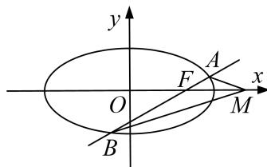

<!-- question-source:start -->
[例 1] (2018·全国I)设椭圆 C: $\frac{x^{2}}{2} + y^{2} = 1$ 的右焦点为 F，过 F 的直线 l 与 C 交于 A，B 两点，点 M 的坐标为 $(2, 0)$ .

(1)当 l 与 x 轴垂直时，求直线 AM 的方程；

(2)设 O 为坐标原点，证明： $\angle OMA = \angle OMB$ .

(2) 当 l 与 x 轴重合时， $\angle OMA = \angle OMB = 0^{\circ}$ .

当 l 与 x 轴垂直时，OM 为 AB 的垂直平分线，所以 $\angle OMA = \angle OMB$ .

当 l 与 x 轴不重合也不垂直时，设 l 的方程为 $y=k(x-1)(k\neq0)$ ， $A(x_{1},y_{1})$ ， $B(x_{2},y_{2})$ ，

则 $x_{1} < \sqrt{2}$ ， $x_{2} < \sqrt{2}$ ，直线 $MA$ ， $MB$ 的斜率之和为 $k_{MA} + k_{MB} = \frac{y_1}{x_1 - 2} + \frac{y_2}{x_2 - 2}$ .

由 $y_{1}=kx_{1}-k,\quad y_{2}=kx_{2}-k$ ，得 $k_{MA}+k_{MB}=\frac{2kx_{1}x_{2}-3k(x_{1}+x_{2})+4k}{(x_{1}-2)(x_{2}-2)}$

将 $y=k(x-1)$ 代入 $\frac{x^{2}}{2}+y^{2}=1$ ，得 $(2k^{2}+1)x^{2}-4k^{2}x+2k^{2}-2=0$ ，

所以 $x_{1} + x_{2} = \frac{4k^{2}}{2k^{2} + 1}, x_{1}x_{2} = \frac{2k^{2} - 2}{2k^{2} + 1}$ . 则 $2kx_{1}x_{2} - 3k(x_{1} + x_{2}) + 4k = \frac{4k^{3} - 4k - 12k^{3} + 8k^{3} + 4k}{2k^{2} + 1} = 0$ .

从而 $k_{MA} + k_{MB} = 0$ ，故 MA，MB 的倾斜角互补．所以 $\angle OMA = \angle OMB$ .

综上， $\angle OMA = \angle OMB$ 成立.
<!-- question-source:end -->

![[高中/总复习/专题/圆锥曲线/专题30  证明数量关系型问题-圆锥曲线/专题30_证明数量关系型问题/例题选讲/例题/answers/Q00032711A1.md]]
