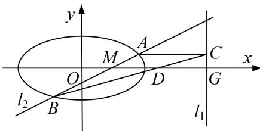

<!-- question-source:start -->
[例 4] 已知椭圆 $E: \frac{x^2}{a^2} + \frac{y^2}{b^2} = 1 (a > b > 0)$ 的焦距为 $2\sqrt{3}$ ，直线 $l_1: x = 4$ 与 $x$ 轴的交点为 $G$ ，过点 $M(1, 0)$ 且不与 $x$ 轴重合的直线 $l_2$ 交椭圆 $E$ 于点 $A, B$ 。当 $l_2$ 垂直于 $x$ 轴时， $\triangle ABG$ 的面积为 $\frac{3\sqrt{3}}{2}$ 。

(1)求椭圆 E 的方程;

(2)若 $AC \perp l_{1}$ ，垂足为 C，直线 BC 交 x 轴于点 D，证明： $|MD| = |DG|$ .

(2)设 $A(x_{1}, y_{1})$ ， $B(x_{2}, y_{2})$ ，则 $C(4, y_{1})$ .

因为直线 $l_{2}$ 不与 x 轴重合，故可设 $l_{2}$ 的方程为 $x=my+1$ ，联立得 $\left\{\begin{aligned}x&=my+1,\\ \frac{x^{2}}{4}&+y^{2}=1,\end{aligned}\right.$

整理得 $(m^2 + 4)y^2 + 2my - 3 = 0$ ，所以 $\Delta = 16(m^2 + 3) > 0$ ， $y_1 + y_2 = \frac{-2m}{m^2 + 4}$ ， $y_1y_2 = \frac{-3}{m^2 + 4}$ ，

所以直线 BC: $y-y_{1}=\frac{y_{1}-y_{2}}{4-x_{2}}(x-4)$ ，令 y=0，则 $x=\frac{y_{1}-x_{2}-4}{y_{1}-y_{2}}+4$ ，

所以点 D 的横坐标 $x_{D}=\frac{y_{1}(x_{2}-4)}{y_{1}-y_{2}}+4,$

所以 $x_{D} - \frac{5}{2} = \frac{y_{1}(x_{2} - 4)}{y_{1} - y_{2}} +4 - \frac{5}{2} = \frac{y_{1}(my_{2} - 3)}{y_{1} - y_{2}} +\frac{3}{2} = \frac{2y_{1}(my_{2} - 3) + 3y_{1} - 3y_{2}}{2(y_{1} - y_{2})}$

$$
= \frac {2 m y _ {1} y _ {2} - 3 \left(y _ {1} + y _ {2}\right)}{2 \left(y _ {1} - y _ {2}\right)} = \frac {\frac {- 6 m}{m ^ {2} + 4} + \frac {6 m}{m ^ {2} + 4}}{2 \quad y _ {1} - y _ {2}} = 0,
$$

所以 $x_{D} = \frac{5}{2}$ ，因为 $MG$ 中点的横坐标为 $\frac{5}{2}$ ，所以 $D$ 为线段 $MG$ 的中点，所以 $|MD| = |DG|$
<!-- question-source:end -->

![[高中/总复习/专题/圆锥曲线/专题30  证明数量关系型问题-圆锥曲线/专题30_证明数量关系型问题/例题选讲/例题/answers/Q00032714A1.md]]
