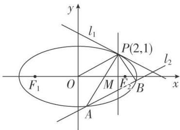

<!-- question-source:start -->
[例6] 已知椭圆 $C: \frac{x^2}{a^2} + \frac{y^2}{b^2} = 1 (a > b > 0)$ 过点 $P(2, 1), F_1, F_2$ 分别为椭圆 $C$ 的左、右焦点，且 $\cdot = -1$ .

(1)求椭圆 $C$ 的方程；

(2)过 $P$ 点的直线 $l_{1}$ 与椭圆 $C$ 有且只有一个公共点，直线 $l_{2}$ 平行于 $OP(O$ 为原点)，且与椭圆 $C$ 交于 $A$ ， $B$ 两点，与直线 $x = 2$ 交于点 $M(M$ 介于 $A$ ， $B$ 两点之间).

①当 $\triangle PAB$ 面积最大时，求直线 $l_{2}$ 的方程；

②求证： $|PA|\cdot|MB|=|PB|\cdot|MA|$ .

(2)①由于 $k_{OP} = \frac{1}{2}$ ，设直线 $l_{2}$ 的方程为 $y = \frac{1}{2} x + t$ ， $A(x_{1}, y_{1})$ ， $B(x_{2}, y_{2})$

由 $\left\{\begin{aligned}y&=\frac{1}{2}x+t,\\ \frac{x^{2}}{8}&+\frac{y^{2}}{2}=1,\end{aligned}\right.$ 消去 y 整理得 $x^{2}+2tx+2t^{2}-4=0,\quad\left\{\begin{aligned}x_{1}+x_{2}&=-2t,\\ x_{1}x_{2}&=2t^{2}-4,\\ \Delta&=-4(t^{2}-4)>0\Rightarrow t^{2}<4,\end{aligned}\right.$

$$
| A B | = \sqrt {1 + \frac {1}{4}} \sqrt {(x _ {1} + x _ {2}) ^ {2} - 4 x _ {1} x _ {2}} = \frac {\sqrt {5}}{2} \sqrt {4 t ^ {2} - 4 (2 t ^ {2} - 4)} = \frac {\sqrt {5}}{2} \sqrt {1 6 - 4 t ^ {2}} = \sqrt {5} \sqrt {4 - t ^ {2}},
$$

又点 $P$ 到直线 $l_{2}$ 的距离 $d = \frac{|t|}{\sqrt{1 + \left(\frac{1}{2}\right)^{2}}} = \frac{2|t|}{\sqrt{5}}.$

所以 $S_{\triangle PAB} = \frac{1}{2}\times \sqrt{5}\sqrt{4 - t^2}\times \frac{2|t|}{\sqrt{5}} = \sqrt{(4 - t^2)t^2}\leq \frac{t^2 + (4 - t^2)}{2} = 2.$

当且仅当 $4-t^{2}=t^{2}$ 时取等号，此时 $t^{2}=2$ ，

又 $M$ 介于 $A, B$ 两点之间，故 $t = -\sqrt{2}$ ，故直线 $l_{2}$ 的方程为 $y = \frac{1}{2} x - \sqrt{2}$ .

②证明：要证结论成立，只需证明 $\frac{|PA|}{|MA|} = \frac{|PB|}{|MB|}$ ，由角平分线性质，

即证直线 x=2 为 $\angle APB$ 的平分线，转化成证明 $k_{PA}+k_{PB}=0$ .

$$
k _ {P A} + k _ {P B} = \frac {y _ {1} - 1}{x _ {1} - 2} + \frac {y _ {2} - 1}{x _ {2} - 2} = \frac {\left[ \left(\frac {1}{2} x _ {1} + t\right) - 1 \right] (x _ {2} - 2) + \left[ \left(\frac {1}{2} x _ {2} + t\right) - 1 \right] (x _ {1} - 2)}{(x _ {1} - 2) (x _ {2} - 2)}
$$

$$
= \frac {x _ {1} x _ {2} + (t - 2) \left(x _ {1} + x _ {2}\right) - 4 (t - 1)}{\left(x _ {1} - 2\right) \left(x _ {2} - 2\right)} = \frac {2 t ^ {2} - 4 - 2 t (t - 2) - 4 (t - 1)}{\left(x _ {1} - 2\right) \left(x _ {2} - 2\right)} = \frac {2 t ^ {2} - 4 - 2 t ^ {2} + 4 t - 4 t + 4}{\left(x _ {1} - 2\right) \left(x _ {2} - 2\right)} = 0,
$$

因此结论成立.
<!-- question-source:end -->

![[高中/总复习/专题/圆锥曲线/专题30  证明数量关系型问题-圆锥曲线/专题30_证明数量关系型问题/例题选讲/例题/answers/Q00032716A1.md]]
