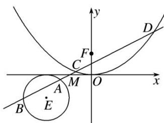

<!-- question-source:start -->
[例10] 已知顶点是坐标原点的抛物线 $\Gamma$ 的焦点 $F$ 在 $y$ 轴正半轴上，圆心在直线 $y = \frac{1}{2} x$ 上的圆 $E$ 与 $x$ 轴相切，且 $E, F$ 关于点 $M(-1, 0)$ 对称.

(1)求 E 和 $\Gamma$ 的标准方程;

(2)过点 M 的直线 l 与 E 交于 A, B, 与 $\Gamma$ 交于 C, D, 求证: $|CD| > \sqrt{2}|AB|$ .

(2)由题意知，直线 l 的斜率存在，设 l 的斜率为 k，那么其方程为 $y=k(x+1)(k\neq0)$ ,

则 $E(-2, -1)$ 到 $l$ 的距离 $d = \frac{|k - 1|}{\sqrt{k^2 + 1}}$ ，因为 $l$ 与 $E$ 交于 $A, B$ 两点，

所以 $d^2 < r^2$ ，即 $\frac{k - 1}{k^2 + 1} < 1$ ，解得 $k > 0$ ，所以 $|AB| = 2\sqrt{1 - d^2} = 2\sqrt{\frac{2k}{k^2 + 1}}$ .

由 $\left\{ \begin{array}{l} x^{2} = 4y, \\ y = k(x + 1) \end{array} \right.$ 消去 $y$ 并整理得 $x^{2} - 4kx - 4k = 0$ . $\Delta = 16k^{2} + 16k > 0$ 恒成立，

设 $C(x_{1}, y_{1})$ ， $D(x_{2}, y_{2})$ ，则 $x_{1} + x_{2} = 4k$ ， $x_{1}x_{2} = -4k$ ，

那么 $|CD|=\sqrt{k^{2}+1}|x_{1}-x_{2}|=\sqrt{k^{2}+1}\cdot\sqrt{(x_{1}+x_{2})^{2}-4x_{1}x_{2}}=4\sqrt{k^{2}+1}\cdot\sqrt{k^{2}+k}.$

所以 $\frac{|CD|^2}{|AB|^2} = \frac{16(k^2 + 1)(k^2 + k)}{\frac{8k}{k^2 + 1}} = \frac{2(k^2 + 1)^2(k^2 + k)}{k} = \frac{2k(k^2 + 1)^2(k + 1)}{k} >\frac{2k}{k} = 2.$

所以 $|CD|^{2}>2|AB|^{2}$ ，即 $|CD|>\sqrt{2}|AB|$ .
<!-- question-source:end -->

![[高中/总复习/专题/圆锥曲线/专题30  证明数量关系型问题-圆锥曲线/专题30_证明数量关系型问题/例题选讲/例题/answers/Q00032720A1.md]]
