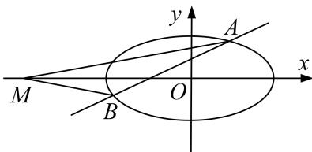

<!-- question-source:start -->
1. 已知椭圆 $C: \frac{x^2}{a^2} + \frac{y^2}{b^2} = 1 (a > b > 0)$ 的一个焦点为 $F(-1, 0)$ ，点 $P\left(\frac{2}{3}, \frac{2\sqrt{6}}{3}\right)$ 在 $C$ 上.

(1)求椭圆 C 的方程;

(2)已知点 $M(-4, 0)$ ，过 F 作直线 l 交椭圆于 A，B 两点，求证： $\angle FMA = \angle FMB$ .

<!-- question-source:end -->

![[高中/总复习/专题/圆锥曲线/专题30  证明数量关系型问题-圆锥曲线/专题30_证明数量关系型问题/对点训练/题目/answers/Q00032721A1.md]]
