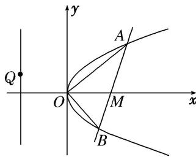

<!-- question-source:start -->
6. 如图所示，已知直线 $l$ 过点 $M(4, 0)$ 且与抛物线 $y^{2} = 2px (p > 0)$ 交于 $A$ ， $B$ 两点，以弦 $AB$ 为直径的圆恒过坐标原点 $O$ .

(1)求抛物线的标准方程;

(2)设 Q 是直线 x=-4 上任意一点，求证：直线 QA, QM, QB 的斜率依次成等差数列.

<!-- question-source:end -->

![[高中/总复习/专题/圆锥曲线/专题30  证明数量关系型问题-圆锥曲线/专题30_证明数量关系型问题/对点训练/题目/answers/Q00032726A1.md]]
