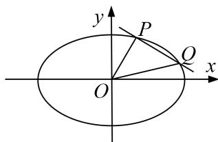

<!-- question-source:start -->
7. 已知椭圆 $C: \frac{x^2}{a^2} + \frac{y^2}{b^2} = 1 (a > b > 0)$ 的离心率为 $\frac{\sqrt{3}}{2}$ ，焦距为 $2\sqrt{3}$ .

(1)求椭圆 C 的方程;

(2)若斜率为 $-\frac{1}{2}$ 的直线与椭圆 C 交于 P, Q 两点(点 P, Q 均在第一象限), O 为坐标原点, 证明: 直线 OP, PQ, OQ 的斜率依次成等比数列.

<!-- question-source:end -->

![[高中/总复习/专题/圆锥曲线/专题30  证明数量关系型问题-圆锥曲线/专题30_证明数量关系型问题/对点训练/题目/answers/Q00032727A1.md]]
