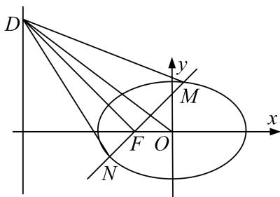

<!-- question-source:start -->
8. 已知椭圆 $E: \frac{x^2}{a^2} + \frac{y^2}{b^2} = 1 (a > b > 0)$ 的离心率为方程 $2x^2 - 3x + 1 = 0$ 的解，点 $A, B$ 分别为椭圆 $E$ 的左、右顶点，点 $C$ 在 $E$ 上，且 $\triangle ABC$ 面积的最大值为 $2\sqrt{3}$ .

(1)求椭圆 E 的方程;

(2)设 F 为 E 的左焦点，点 D 在直线 x = -4 上，过 F 作 DF 的垂线交椭圆 E 于 M，N 两点．证明：直线 OD 把 $\triangle DMN$ 分为面积相等的两部分.

<!-- question-source:end -->

![[高中/总复习/专题/圆锥曲线/专题30  证明数量关系型问题-圆锥曲线/专题30_证明数量关系型问题/对点训练/题目/answers/Q00032728A1.md]]
