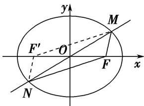

> [!faq]- 教师版对点训练解析
>
> > [!success]- **【答案】** 详见解析
>
> > [!note]- **【分析】**
> > 本题未单列分析。
>
> > [!note]- **【解析】**
> > 解析 (1)如图, 取椭圆 $C$ 的左焦点 $F'$ , 连接 $MF'$ , $NF'$ ,
> > 由椭圆的几何性质知 $|NF|=|MF'|$ ，则 $|MF'|+|MF|=2a=4$ ，得a=2.
> > 将点 $\left(-1,\frac{\sqrt{3}}{2}\right)$ 代入椭圆C的方程得 $\frac{1}{a^{2}}+\frac{3}{4b^{2}}=1$ ，解得b=1。
> > 故椭圆 C 的方程为 $\frac{x^{2}}{4} + y^{2} = 1$ .
> > 
> > (2)设点 A 的坐标为 $(x_{1}, y_{1})$ ，点 B 的坐标为 $(x_{2}, y_{2})$ .
> > 由图可知直线 AB 的斜率存在，设直线 AB 的方程为 $y=k(x-4)(k\neq0)$ 。联立方程 $\left\{\begin{aligned}\frac{x^{2}}{4}+y^{2}&=1,\\ y&=k(x-4),\end{aligned}\right.$
> > 消去 $y$ 得， $(4k^{2} + 1)x^{2} - 32k^{2}x + 64k^{2} - 4 = 0$ ， $\Delta = (-32k^{2})^{2} - 4(4k^{2} + 1)(64k^{2} - 4) > 0$ ， $k^{2} < \frac{1}{12}$ ，
> > $\left\{ \begin{array}{l} x_{1} + x_{2} = \frac{32k^{2}}{4k^{2} + 1}, \\ x_{1}x_{2} = \frac{64k^{2} - 4}{4k^{2} + 1}, \end{array} \right.$ 直线 $AP$ 的斜率为 $\frac{y_1}{x_1 - 1} = \frac{k(x_1 - 4)}{x_1 - 1}$ .
> > 同理直线 $BP$ 的斜率为 $\frac{k(x_2 - 4)}{x_2 - 1}$ .
> > $$
> > \text {由} \frac {k \left(x _ {1} - 4\right)}{x _ {1} - 1} + \frac {k \left(x _ {2} - 4\right)}{x _ {2} - 1} = \frac {k \left(x _ {1} - 4\right) \left(x _ {2} - 1\right) + k \left(x _ {2} - 4\right) \left(x _ {1} - 1\right)}{\left(x _ {1} - 1\right) \left(x _ {2} - 1\right)} = \frac {k \left[ 2 x _ {1} x _ {2} - 5 \left(x _ {1} + x _ {2}\right) + 8 \right]}{x _ {1} x _ {2} - \left(x _ {1} + x _ {2}\right) + 1}
> > $$
> > $$
> > = \frac {k \left(\frac {1 2 8 k ^ {2} - 8}{4 k ^ {2} + 1} - \frac {1 6 0 k ^ {2}}{4 k ^ {2} + 1} + 8\right)}{\frac {6 4 k ^ {2} - 4}{4 k ^ {2} + 1} - \frac {3 2 k ^ {2}}{4 k ^ {2} + 1} + 1} = \frac {k (1 2 8 k ^ {2} - 8 - 1 6 0 k ^ {2} + 3 2 k ^ {2} + 8)}{6 4 k ^ {2} - 4 - 3 2 k ^ {2} + 4 k ^ {2} + 1} = \frac {k (1 6 0 k ^ {2} - 8 - 1 6 0 k ^ {2} + 8)}{3 6 k ^ {2} - 3} = 0.
> > $$
> > 由上得直线 AP 与 BP 的斜率互为相反数，可得 $\angle APO = \angle BPQ$ .
