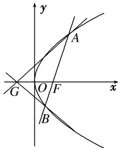

<!-- question-source:start -->
[例 6] 已知点 F 为抛物线 E: $y^{2}=2px(p>0)$ 的焦点，点 A(2, m) 在抛物线 E 上，且 $|AF|=3$ .

(1)求抛物线 E 的方程;

(2)已知点 $G(-1,0)$ ，延长 $AF$ 交抛物线 $E$ 于点 $B$ ，证明：以点 $F$ 为圆心且与直线 $GA$ 相切的圆，必与直线 $GB$ 相切.

[规范解答]
<!-- question-source:end -->

![[高中/总复习/专题/圆锥曲线/专题31  证明位置关系型问题-圆锥曲线/专题31__证明位置关系型问题/例题/answers/Q00042688A1.md]]
