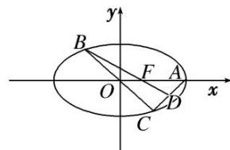

<!-- question-source:start -->
[例 7] 设椭圆 $E: \frac{x^2}{a^2} + \frac{y^2}{b^2} = 1 (a > b > 0)$ 的右焦点为 $F$ ，右顶点为 $A, B, C$ 是椭圆上关于原点对称的两点 $(B, C$ 均不在 $x$ 轴上)，线段 $AC$ 的中点为 $D$ ，且 $B, F, D$ 三点共线.

(1)求椭圆 E 的离心率;

(2)设 $F(1,0)$ ，过 $F$ 的直线 $l$ 交 $E$ 于 $M$ ， $N$ 两点，直线 $MA$ ， $NA$ 分别与直线 $x = 9$ 交于 $P$ ， $Q$ 两点．证明：以 $PQ$ 为直径的圆过点 $F$ .

[规范解答]
<!-- question-source:end -->

![[高中/总复习/专题/圆锥曲线/专题31  证明位置关系型问题-圆锥曲线/专题31__证明位置关系型问题/例题/answers/Q00042689A1.md]]
