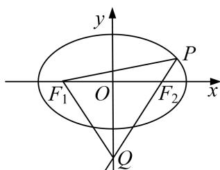

<!-- question-source:start -->
[例 9] 设椭圆 $E: \frac{x^{2}}{a^{2}} + \frac{y^{2}}{1 - a^{2}} = 1$ 的焦点在 x 轴上.

(1)若椭圆 E 的焦距为 1，求椭圆 E 的方程；

(2)设 $F_{1}$ ， $F_{2}$ 分别是椭圆 $E$ 的左、右焦点， $P$ 为椭圆 $E$ 上第一象限内的点，直线 $F_{2}P$ 交 $y$ 轴于点 $Q$ 并且 $F_{1}P \perp F_{1}Q$ 。证明：当 $a$ 变化时，点 $P$ 在某定直线上。

[规范解答]
<!-- question-source:end -->

![[高中/总复习/专题/圆锥曲线/专题31  证明位置关系型问题-圆锥曲线/专题31__证明位置关系型问题/例题/answers/Q00042691A1.md]]
