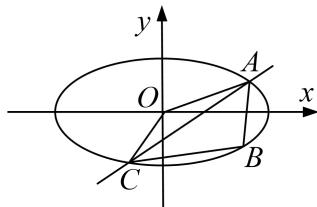

<!-- question-source:start -->
9. 直线 $y = kx + m (m \neq 0)$ 与椭圆 $W: \frac{x^2}{4} + y^2 = 1$ 相交于 $A, C$ 两点， $O$ 是坐标原点.

(1)当点 B 的坐标为 $(0, 1)$ ，且四边形 OABC 为菱形时，求 AC 的长；

(2)当点 B 在 W 上且不是 W 的顶点时，证明：四边形 OABC 不可能为菱形.

<!-- question-source:end -->

![[高中/总复习/专题/圆锥曲线/专题31  证明位置关系型问题-圆锥曲线/专题31__证明位置关系型问题/对点训练/answers/Q00042699A1.md]]
