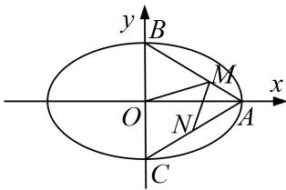

> [!faq]- 《专题31  证明位置关系型问题-圆锥曲线》例题解析
>
> > [!success]- **【答案】** 详见解析
>
> > [!note]- **【分析】**
> > 本题未单列分析。
>
> > [!note]- **【解析】**
> > (1)求 E 的离心率 e;
> >
> > (2)设点 C 的坐标为 $(0, -b)$ ，N 为线段 AC 的中点，证明： $MN \perp AB$ .
> >
> > 
> >
> > 3. 解析
> > (1)由题设条件知，点 $M$ 的坐标为 $\left(\frac{2}{3} a, \frac{1}{3} b\right)$ ，又 $k_{OM} = \frac{\sqrt{5}}{10}$ ，从而 $\frac{b}{2a} = \frac{\sqrt{5}}{10}$ 进而得 $a = \sqrt{5} b$ ， $c = \sqrt{a^2 - b^2} = 2b$ ，故 $e = \frac{c}{a} = \frac{2\sqrt{5}}{5}$ .
> >
> > (2)证明：由 N 是 AC 的中点知，点 N 的坐标为 $\left(\frac{a}{2}, -\frac{b}{2}\right)$ ，可得 $\overrightarrow{NM} = \left(\frac{a}{6}, \frac{5b}{6}\right)$ .
> >
> > 又 $\overrightarrow{AB} = (-a, b)$ ，从而有 $\overrightarrow{AB} \cdot \overrightarrow{NM} = -\frac{1}{6} a^2 + \frac{5}{6} b^2 = \frac{1}{6}(5b^2 - a^2)$ .
> >
> > 由
> > (1)可知 $a^{2}=5b^{2}$ ，所以 $\overrightarrow{AB}\cdot\overrightarrow{NM}=0$ ，故 $MN\perp AB$ .
