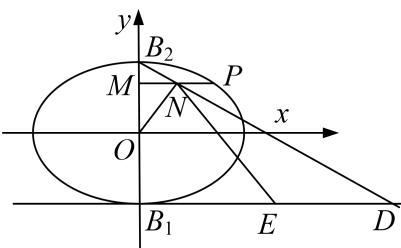

> [!faq]- 《专题31  证明位置关系型问题-圆锥曲线》例题解析
>
> > [!success]- **【答案】** 详见解析
>
> > [!note]- **【分析】**
> > 本题未单列分析。
>
> > [!note]- **【解析】**
> > (1)求椭圆 C 的方程;
> >
> > (2)设 $B_{1}$ , $B_{2}$ 分别是椭圆 $C$ 的下顶点和上顶点, $P$ 是椭圆上异于 $B_{1}$ , $B_{2}$ 的任意一点, 过点 $P$ 作 $PM \perp y$ 轴于 $M$ , $N$ 为线段 $PM$ 的中点, 直线 $B_{2}N$ 与直线 $y = -1$ 交于点 $D$ , $E$ 为线段 $B_{1}D$ 的中点, $O$ 为坐标原点, 求证: $ON \perp EN$ .
> >
> > 
> >
> > 4. 解析
> > (1)由题设知焦距为 $2\sqrt{3}$ ，所以 $c = \sqrt{3}$ ，又因为椭圆过点 $\left[\sqrt{3}, \frac{1}{2}\right]$ ，所以代入椭圆方程得 $\frac{3}{a^2} + \frac{1}{b^2} = 1$ ，因为 $a^2 = b^2 + c^2$ ，解得 $a = 2, b = 1$ ，故所求椭圆 $C$ 的方程是 $\frac{x^2}{4} + y^2 = 1$ .
> >
> > (2)设 $P(x_0,y_0)$ ， $x_0\neq 0$ ，则 $M(0,y_0),N\left(\frac{x_0}{2},y_0\right).$
> >
> > 因为点 P 在椭圆 C 上，所以 $\frac{x_{0}^{2}}{4} + y_{0}^{2} = 1$ ，即 $x_{0}^{2} = 4 - 4y_{0}^{2}$ .
> >
> > 又 $B_{2}(0,1)$ ，所以直线 $B_{2}N$ 的方程为 $y - 1 = \frac{2(y_0 - 1)}{x_0} x$ ，令 $y = -1$ ，得 $x = \frac{x_0}{1 - y_0}$ ，所以 $D\left(\frac{x_0}{1 - y_0}, - 1\right)$ 又 $B_{1}(0, - 1)$ ， $E$ 为线段 $B_{1}D$ 的中点，所以 $E\left(\frac{x_0}{2(1 - y_0)}, - 1\right)$ 所以 $\overrightarrow{ON} = \left(\frac{x_0}{2},y_0\right),\overrightarrow{EN} = \left(\frac{x_0}{2} -\frac{x_0}{2(1 - y_0)},y_0 + 1\right)$ 因为 $\overrightarrow{ON}\cdot \overrightarrow{EN} = \frac{x_0}{2}\left[\frac{x_0}{2} -\frac{x_0}{2(1 - y_0)}\right] + y_0(y_0 + 1) = \frac{x_0^2}{4} -\frac{x_0^2}{4(1 - y_0)} +y_0^2 +y_0 = 1 - \frac{4 - 4y_0^2}{4(1 - y_0)} +y_0 = 1 - y_0 - 1 + y_0 = 0,$ 所以 $\overrightarrow{ON}\bot \overrightarrow{EN}$ ，即 $ON\bot EN$
