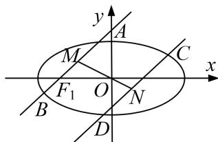

<!-- question-source:start -->
[例1] 设椭圆 $E: \frac{x^2}{a^2} + \frac{y^2}{b^2} = 1 (a > b > 0)$ 的左、右焦点分别为 $F_1, F_2$ ，过点 $F_1$ 的直线交椭圆 $E$ 于 $A, B$ 两点．若椭圆 $E$ 的离心率为 $\frac{\sqrt{2}}{2}$ ， $\triangle ABF_2$ 的周长为 $4\sqrt{6}$ .

(1)求椭圆 E 的方程;

(2)设不经过椭圆的中心而平行于弦 $AB$ 的直线交椭圆 $E$ 于点 $C, D$ , 设弦 $AB, CD$ 的中点分别为 $M, N$ , 证明: $O, M, N$ 三点共线.

(2)当直线 AB, CD 的斜率不存在时，由椭圆的对称性知，

中点 M, N 在 x 轴上，O, M, N 三点共线，

当直线 AB, CD 的斜率存在时，设其斜率为 k，且设 $A(x_{1}, y_{1})$ ， $B(x_{2}, y_{2})$ ， $M(x_{0}, y_{0})$ ，

则 $\left\{ \begin{array}{l} \frac{x_1^2}{6} + \frac{y_1^2}{3} = 1, \\ \frac{x_2^2}{6} + \frac{y_2^2}{3} = 1, \end{array} \right.$ 两式相减，得 $\frac{x_1^2}{6} + \frac{y_1^2}{3} - \left( \frac{x_2^2}{6} + \frac{y_2^2}{3} \right) = 0, \therefore \frac{x_1^2 - x_2^2}{6} = -\frac{y_1^2 - y_2^2}{3},$

$$
\frac {(x _ {1} - x _ {2}) (x _ {1} + x _ {2})}{6} = - \frac {(y _ {1} - y _ {2}) (y _ {1} + y _ {2})}{3}, \therefore \frac {y _ {1} - y _ {2}}{x _ {1} - x _ {2}} \frac {y _ {1} + y _ {2}}{x _ {1} + x _ {2}} = - \frac {3}{6}, \frac {y _ {1} - y _ {2}}{x _ {1} - x _ {2}} \frac {y _ {0}}{x _ {0}} = - \frac {3}{6},
$$

即 $k \cdot k_{OM} = -\frac{1}{2}, \therefore k_{OM} = -\frac{1}{2k}$ . 同理可得 $k_{ON} = -\frac{1}{2k}, \therefore k_{OM} = k_{ON}, \therefore O, M, N$ 三点共线.
<!-- question-source:end -->

![[高中/总复习/专题/圆锥曲线/专题31  证明位置关系型问题-圆锥曲线/专题31_证明位置关系型问题/例题选讲/例题/answers/Q00032730A1.md]]
