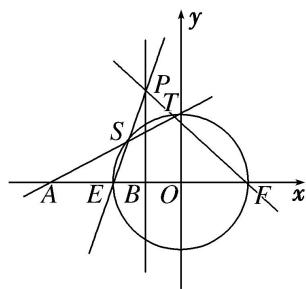

<!-- question-source:start -->
[例 2] 已知点 A(-4, 0)，直线 l: x = -1 与 x 轴交于点 B，动点 M 到 A，B 两点的距离之比为 2.

(1)求点 M 的轨迹 C 的方程;

(2)设 $C$ 与 $x$ 轴交于 $E, F$ 两点， $P$ 是直线 $l$ 上一点，且点 $P$ 不在 $C$ 上，直线 $PE, PF$ 分别与 $C$ 交于另一点 $S, T$ ，证明： $A, S, T$ 三点共线.

(2)证明：由(1)知曲线 C 的方程为 $x^{2}+y^{2}=4$ ，令 y=0 得 $x=\pm2$ ，不妨设 $E(-2,0)$ ， $F(2,0)$ ，如图所示。设 $P(-1,y_{0})$ ， $S(x_{1},y_{1})$ ， $T(x_{2},y_{2})$ ，则直线 PE 的方程为 $y=y_{0}(x+2)$ ，

由 $\left\{ \begin{array}{l} y = y_0(x + 2), \\ x^2 + y^2 = 4 \end{array} \right.$ 得 $(y_0^2 + 1)x^2 + 4y_0^2x + 4y_0^2 - 4 = 0$ ，所以 $-2x_1 = \frac{4y_0^2 - 4}{y_0^2 + 1}$ ，即 $x_1 = \frac{2 - 2y_0^2}{y_0^2 + 1}$ ， $y_1 = \frac{4y_0}{y_0^2 + 1}$ .

直线 PF 的方程为 $y=-\frac{y_{0}}{3}(x-2)$ ，由 $\left\{\begin{aligned}y&=-\frac{y_{0}}{3}\quad x-2\\ x^{2}&+y^{2}=4\end{aligned}\right.$ ，得 $(y_{0}^{2}+9)x^{2}-4y_{0}^{2}x+4y_{0}^{2}-36=0$ ，

所以 $2x_{2}=\frac{4y_{0}^{2}-36}{y_{0}^{2}+9}$ ，即 $x_{2}=\frac{2y_{0}^{2}-18}{y_{0}^{2}+9}$ ， $y_{2}=\frac{12y_{0}}{y_{0}^{2}+9}$ ，所以 $k_{AS}=\frac{y_{1}}{x_{1}+4}=\frac{\frac{4y_{0}}{y_{0}^{2}+1}}{\frac{2-2y_{0}^{2}}{y_{0}^{2}+1}+4}=\frac{2y_{0}}{y_{0}^{2}+3}$

$k_{AT}=\frac{y_{2}}{x_{2}+4}=\frac{\frac{12y_{0}}{y_{0}^{2}+9}}{\frac{2y_{0}^{2}-18}{y_{0}^{2}+9}+4}=\frac{2y_{0}}{y_{0}^{2}+3}$ ，所以 $k_{AS}=k_{AT}$ ，所以A，S，T三点共线.
<!-- question-source:end -->

![[高中/总复习/专题/圆锥曲线/专题31  证明位置关系型问题-圆锥曲线/专题31_证明位置关系型问题/例题选讲/例题/answers/Q00032731A1.md]]
