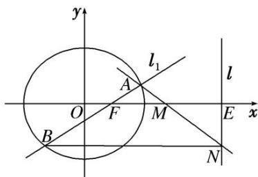

<!-- question-source:start -->
[例 4] 已知椭圆 $\frac{x^{2}}{5}+\frac{y^{2}}{4}=1$ 的右焦点为 F，设直线 l: x=5 与 x 轴的交点为 E，过点 F 且斜率为 k 的直线 $l_{1}$ 与椭圆交于 A，B 两点，M 为线段 EF 的中点.

(1)若直线 $l_{1}$ 的倾斜角为 $\frac{\pi}{4}$ ，求 $|AB|$ 的值；

(2)设直线 $AM$ 交直线 $l$ 于点 $N$ , 证明: 直线 $BN \perp l$ .

(1)∵直线 $l_{1}$ 的倾斜角为 $\frac{\pi}{4}$ ，∴k=1．∴直线 $l_{1}$ 的方程为 y=x-1.

代入椭圆方程，可得 $9x^{2}-10x-15=0$ .

设 $A(x_{1},y_{1})$ ， $B(x_{2},y_{2})$ ，则 $x_{1} + x_{2} = \frac{10}{9}$ ， $x_{1}x_{2} = -\frac{5}{3}$

$$
\therefore | A B | = \sqrt {2 (x _ {1} - x _ {2}) ^ {2}} = \sqrt {2} \cdot \sqrt {(x _ {1} + x _ {2}) ^ {2} - 4 x _ {1} x _ {2}} = \sqrt {2} \times \sqrt {\left(\frac {1 0}{9}\right) ^ {2} + 4 \times \frac {5}{3}} = \frac {1 6 \sqrt {5}}{9}.
$$

(2)设直线 $l_{1}$ 的方程为 $y=k(x-1)$ . 代入椭圆方程，得 $(4+5k^{2})x^{2}-10k^{2}x+5k^{2}-20=0$ .

设 $A(x_{1}, y_{1})$ ， $B(x_{2}, y_{2})$ ，则 $x_{1} + x_{2} = \frac{10k^{2}}{4 + 5k^{2}}$ ， $x_{1}x_{2} = \frac{5k^{2} - 20}{4 + 5k^{2}}$ .

设 $N(5, y_{0})$ ，∵ A，M，N 三点共线，∴ $k_{AM} = k_{MN}$ ，即 $\frac{-y_{1}}{3 - x_{1}} = \frac{y_{0}}{2}$ ，∴ $y_{0} = \frac{2y_{1}}{x_{1} - 3}$ .

而 $y_0 - y_2 = \frac{2y_1}{x_1 - 3} - y_2 = \frac{2k(x_1 - 1)}{x_1 - 3} - k(x_2 - 1) = \frac{3k(x_1 + x_2) - kx_1x_2 - 5k}{x_1 - 3} = \frac{3k\cdot\frac{10k^2}{4 + 5k^2} - k\cdot\frac{5k^2 - 20}{4 + 5k^2} - 5k}{x_1 - 3} = 0.$

∴直线 $BN \parallel x$ 轴，即 $BN \perp l$ .
<!-- question-source:end -->

![[高中/总复习/专题/圆锥曲线/专题31  证明位置关系型问题-圆锥曲线/专题31_证明位置关系型问题/例题选讲/例题/answers/Q00032733A1.md]]
