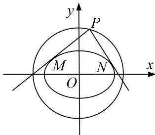

<!-- question-source:start -->
[例5] 已知椭圆 $T: \frac{x^2}{a^2} + \frac{y^2}{b^2} = 1 (a > b > 0)$ 的一个顶点 $A(0, 1)$ ，离心率 $e = \frac{\sqrt{6}}{3}$ ，圆 $C: x^2 + y^2 = 4$ ，从圆 $C$ 上任意一点 $P$ 向椭圆 $T$ 引两条切线 $PM$ ， $PN$ .

(1)求椭圆 T 的方程;

(2)求证： $PM \perp PN$ .

(2)方法一 ①当 P 点横坐标为 $\pm\sqrt{3}$ 时，纵坐标为 $\pm1$ ，PM 斜率不存在，PN 斜率为 0， $PM \perp PN$ .
②当 P 点横坐标不为 $\pm\sqrt{3}$ 时，设 $P(x_{0}, y_{0})$ ，则 $x_{0}^{2} + y_{0}^{2} = 4$ ，设 $k_{PM} = k$ ，PM 的方程为 $y - y_{0} = k(x - x_{0})$ ，
联立方程组 $\left\{\begin{aligned}y-y_{0}&=k(x-x_{0}),\\ \frac{x^{2}}{3}&+y^{2}=1,\end{aligned}\right.$ 消去 y 得 $(1+3k^{2})x^{2}+6k(y_{0}-kx_{0})x+3k^{2}x_{0}^{2}-6kx_{0}y_{0}+3y_{0}^{2}-3=0,$

依题意 $\Delta=36k^{2}(y_{0}-kx_{0})^{2}-4(1+3k^{2})(3k^{2}x_{0}^{2}-6kx_{0}y_{0}+3y_{0}^{2}-3)=0$ ，化简得 $(3-x_{0}^{2})k^{2}+2x_{0}y_{0}k+1-y_{0}^{2}=0$ ，
又 $k_{PM}$ ， $k_{PN}$ 为方程的两根，所以 $k_{PM}\cdot k_{PN}=\frac{1-y_{0}^{2}}{3-x_{0}^{2}}=\frac{1-(4-x_{0}^{2})}{3-x_{0}^{2}}=\frac{x_{0}^{2}-3}{3-x_{0}^{2}}=-1$ .

所以 $PM \perp PN$ ，综上知 $PM \perp PN$ .

方法二 ①当 P 点横坐标为 $\pm\sqrt{3}$ 时，纵坐标为 $\pm1$ ，PM 斜率不存在，PN 斜率为 0， $PM \perp PN$ .

$$
\pm \sqrt {3}
$$

$$
P (2 \cos \theta , 2 \sin \theta)
$$

$$
y - 2 \sin \theta = k (x - 2 \cos \theta)
$$

$\left\{ \begin{array}{l} y - 2\sin \theta = k(x - 2\cos \theta), \\ \frac{x^2}{3} + y^2 = 1, \end{array} \right.$ 联立得 $(1 + 3k^2)x^2 + 12k(\sin \theta - k\cos \theta)x + 12(\sin \theta - k\cos \theta)^2 - 3 = 0,$

$$
\Delta = 0 \text {, 即} \Delta = 1 4 4 k ^ {2} (\sin \theta - k \cos \theta) ^ {2} - 4 (1 + 3 k ^ {2}) [ 1 2 (\sin \theta - k \cos \theta) ^ {2} - 3 ] = 0,
$$

化简得 $(3 - 4\cos^2\theta)k^2 + 4\sin 2\theta \cdot k + 1 - 4\sin^2\theta = 0$ ， $k_{PM} \cdot k_{PN} = \frac{1 - 4\sin^2\theta}{3 - 4\cos^2\theta} = \frac{(4 - 4\sin^2\theta) - 3}{3 - 4\cos^2\theta} = -1.$

所以 $PM \perp PN$ ，综上知 $PM \perp PN$ .
<!-- question-source:end -->

![[高中/总复习/专题/圆锥曲线/专题31  证明位置关系型问题-圆锥曲线/专题31_证明位置关系型问题/例题选讲/例题/answers/Q00032734A1.md]]
