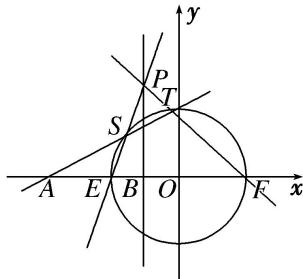

> [!faq]- 教师版例题解析
>
> > [!success]- **【答案】** 详见解析
>
> > [!note]- **【分析】**
> > 本题未单列分析。
>
> > [!note]- **【解析】**
> > [规范解答] (1)设点 $M(x, y)$ ，依题意， $\frac{|MA|}{|MB|} = \frac{\sqrt{(x+4)^{2} + y^{2}}}{\sqrt{(x+1)^{2} + y^{2}}} = 2$ ，化简得 $x^{2} + y^{2} = 4$ ，即轨迹 C 的方程为 $x^{2} + y^{2} = 4$ .
> > 
