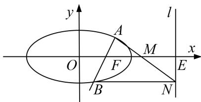

<!-- question-source:start -->
1. 已知椭圆 $\frac{x^2}{5} + \frac{y^2}{4} = 1$ 的右焦点为 $F$ , 设直线 $l: x = 5$ 与 $x$ 轴的交点为 $E$ , 过点 $F$ 且斜率为 $k$ 的直线 $l_1$ 与椭圆交于 $A, B$ 两点, $M$ 为线段 $EF$ 的中点.

(1)若直线 $l_{1}$ 的倾斜角为 $\frac{\pi}{4}$ ，求 $\triangle ABM$ 的面积 $S$ 的值；

(2)过点 B 作 $BN \perp l$ 于点 N，证明：A，M，N 三点共线.

<!-- question-source:end -->

![[高中/总复习/专题/圆锥曲线/专题31  证明位置关系型问题-圆锥曲线/专题31_证明位置关系型问题/对点训练/题目/answers/Q00032739A1.md]]
