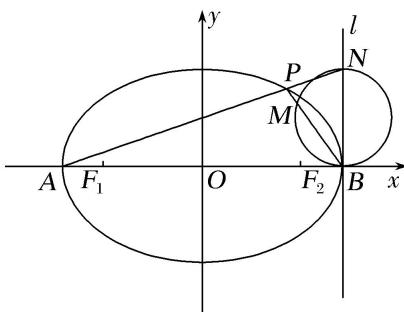

<!-- question-source:start -->
2. 如图，椭圆 $C: \frac{x^2}{a^2} + \frac{y^2}{b^2} = 1 (a > b > 0)$ 的左右焦点分别为 $F_1, F_2$ ，左右顶点分别为 $A, B, P$ 为椭圆 $C$ 上任一点(不与 $A, B$ 重合). 已知 $\triangle PF_1F_2$ 的内切圆半径的最大值为 $2 - \sqrt{2}$ ，椭圆 $C$ 的离心率为 $\frac{\sqrt{2}}{2}$ .

(1)求椭圆 $C$ 的方程;

(2)直线 $l$ 过点 $B$ 且垂直于 $x$ 轴，延长 $AP$ 交 $l$ 于点 $N$ ，以 $BN$ 为直径的圆交 $BP$ 于点 $M$ ，求证： $O$ ， $M$ ， $N$ 三点共线.

<!-- question-source:end -->

![[高中/总复习/专题/圆锥曲线/专题31  证明位置关系型问题-圆锥曲线/专题31_证明位置关系型问题/对点训练/题目/answers/Q00032740A1.md]]
