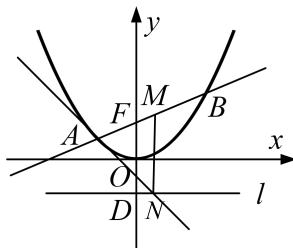

<!-- question-source:start -->
5. 已知抛物线 $C: x^{2} = 2py(p > 0)$ , 过焦点 $F$ 的直线交 $C$ 于 $A, B$ 两点, $D$ 是抛物线的准线 $l$ 与 $y$ 轴的交点. (1) 若 $AB \parallel l$ , 且 $\triangle ABD$ 的面积为 1, 求抛物线的方程;

(2)设 M 为 AB 的中点，过 M 作 l 的垂线，垂足为 N．证明：直线 AN 与抛物线相切.

<!-- question-source:end -->

![[高中/总复习/专题/圆锥曲线/专题31  证明位置关系型问题-圆锥曲线/专题31_证明位置关系型问题/对点训练/题目/answers/Q00032743A1.md]]
