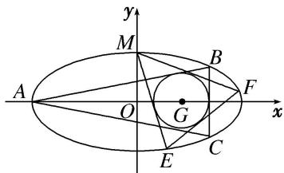

<!-- question-source:start -->
6. 如图，已知圆 $G: (x - 2)^{2} + y^{2} = \frac{4}{9}$ 是椭圆 $C: \frac{x^{2}}{a^{2}} + \frac{y^{2}}{b^{2}} = 1 (a > b > 0)$ 的内接 $\triangle ABC$ 的内切圆，其中 $A(-4,$

0)为椭圆的左顶点.

(1)求椭圆 C 的方程;

(2)过椭圆的上顶点 M 作圆 G 的两条切线交椭圆于 E，F 两点，证明：直线 EF 与圆 G 相切.

<!-- question-source:end -->

![[高中/总复习/专题/圆锥曲线/专题31  证明位置关系型问题-圆锥曲线/专题31_证明位置关系型问题/对点训练/题目/answers/Q00032744A1.md]]
