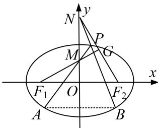

<!-- question-source:start -->
8. 已知椭圆 $E: \frac{x^2}{a^2} + \frac{y^2}{b^2} = 1 (a > b > 0)$ 经过点 $(2\sqrt{2}, 2)$ ，且离心率为 $\frac{\sqrt{2}}{2}$ ， $F_1, F_2$ 是椭圆 $E$ 的左、右焦点。

(1)求椭圆 E 的方程;

(2)若 $A, B$ 是椭圆 $E$ 上关于 $y$ 轴对称的两点 $(A, B$ 不是长轴的端点), 点 $P$ 是椭圆 $E$ 上异于 $A, B$ 的一点, 且直线 $PA, PB$ 分别交 $y$ 轴于点 $M, N$ , 求证: 直线 $MF_{1}$ 与直线 $NF_{2}$ 的交点 $G$ 在定圆上.

<!-- question-source:end -->

![[高中/总复习/专题/圆锥曲线/专题31  证明位置关系型问题-圆锥曲线/专题31_证明位置关系型问题/对点训练/题目/answers/Q00032746A1.md]]
