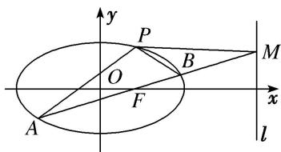

<!-- question-source:start -->
[例1] 如图，椭圆 $C: \frac{x^2}{a^2} + \frac{y^2}{b^2} = 1 (a > b > 0)$ 经过点 $P\left(1, \frac{3}{2}\right)$ ，离心率 $\mathrm{e} = \frac{1}{2}$ ，直线 $l$ 的方程为 $x = 4$ .

(1)求椭圆 C 的方程;

(2)AB 是经过右焦点 F 的任一弦(不经过点 P)，设直线 AB 与直线 l 相交于点 M，记直线 PA，PB，PM 的斜率分别为 $k_{1}$ ， $k_{2}$ ， $k_{3}$ 。问：是否存在常数 $\lambda$ ，使得 $k_{1} + k_{2} = \lambda k_{3}$ ？若存在，求出 $\lambda$ 的值；若不存在，请说明理由。

[破题思路] (1)题目条件中给出椭圆过点 $P\left(1, \frac{3}{2}\right)$ ，离心率 $e = \frac{1}{2}$ 。将 $P$ 点坐标代入椭圆方程可得 $a, b$ 的关系式；用离心率公式可得 $a, c$ 的关系式，另外，还有 $a^2 = b^2 + c^2$ ，即可求得 $a, b$ 的值。

(2)判断是否存在常数 $\lambda$ ，使 $k_{1} + k_{2} = \lambda k_{3}$ 成立．即方程 $k_{1} + k_{2} = \lambda k_{3}$ 是否有解．题目条件中给出直线 $AB$ 过右焦点 $F$ ，且与椭圆及直线 $l$ 分别交于点 $A$ ， $B$ ， $M$ ，直线 $PA$ ， $PB$ ， $PM$ 的斜率分别为 $k_{1}$ ， $k_{2}$ ， $k_{3}$ ，想到用斜率公式表示 $k_{1}$ ， $k_{2}$ ， $k_{3}$ ，需要 $A$ ， $B$ ， $M$ 的坐标，可设出 $A$ ， $B$ ， $M$ 的坐标，通过建立直线 $AB$ 与椭圆方程的方程组求得各坐标的关系.

(2)由题意可设直线 AB 的斜率为 k，则直线 AB 的方程为 $y=k(x-1)$ ，①代入椭圆方程，并整理，得 $(4k^{2}+3)x^{2}-8k^{2}x+4(k^{2}-3)=0$ ，

设 $A(x_{1},y_{1})$ ， $B(x_{2},y_{2})$ ，且 $x_{1}\neq x_{2}\neq 1$ ，则 $x_{1} + x_{2} = \frac{8k^{2}}{4k^{2} + 3}$ ， $x_{1}x_{2} = \frac{4(k^{2} - 3)}{4k^{2} + 3}$ ，②

在方程①中令 x=4，得点 M 的坐标为 $(4, 3k)$ 。从而 $k_{1}=\frac{y_{1}-\frac{3}{2}}{x_{1}-1}$ ， $k_{2}=\frac{y_{2}-\frac{3}{2}}{x_{2}-1}$ ， $k_{3}=\frac{3k-\frac{3}{2}}{4-1}=k-\frac{1}{2}$ .

因为 A, F, B 三点共线，所以 $k=k_{AF}=k_{BF}$ ，即 $\frac{y_{1}}{x_{1}-1}=\frac{y_{2}}{x_{2}-1}=k$ ,

所以 $k_{1} + k_{2} = \frac{y_{1} - \frac{3}{2}}{x_{1} - 1} +\frac{y_{2} - \frac{3}{2}}{x_{2} - 1} = \frac{y_{1}}{x_{1} - 1} +\frac{y_{2}}{x_{2} - 1} -\frac{3}{2}\left(\frac{1}{x_{1} - 1} +\frac{1}{x_{2} - 1}\right) = 2k - \frac{3}{2}\cdot \frac{x_{1} + x_{2} - 2}{x_{1}x_{2} - (x_{1} + x_{2}) + 1},$ ③

将②代入③得， $k_{1}+k_{2}=2k-\frac{3}{2}\cdot\frac{\frac{8k^{2}}{4k^{2}+3}-2}{\frac{4(k^{2}-3)}{4k^{2}+3}-\frac{8k^{2}}{4k^{2}+3}+1}=2k-1$ ，又 $k_{3}=k-\frac{1}{2}$ ，所以 $k_{1}+k_{2}=2k_{3}$ .

故存在常数 $\lambda=2$ 符合题意.

[题后悟通] 求解字母参数值的存在性问题时，通常的方法是首先假设满足条件的参数值存在，然后利用这些条件并结合题目的其他已知条件进行推理与计算，若不出现矛看，并且得到了相应的参数值，就说明满足条件的参数值存在；若在推理与计算中出现了矛盾，则说明满足条件的参数值不存在，同时推理与计算的过程就是说明理由的过程.
<!-- question-source:end -->

![[高中/总复习/专题/圆锥曲线/专题32  探究是否存在常数型问题-圆锥曲线/专题32_探究是否存在常数型问题/例题选讲/例题/answers/Q00032748A1.md]]
