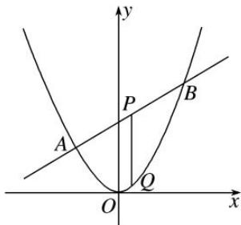

<!-- question-source:start -->
[例2] 已知抛物线 $C: x^{2} = 2py(p > 0)$ 的焦点为 $F$ ，直线 $2x - y + 2 = 0$ 交抛物线 $C$ 于 $A$ ， $B$ 两点， $P$ 是线段 $AB$ 的中点，过 $P$ 作 $x$ 轴的垂线交抛物线 $C$ 于点 $Q$ .

(1)D 是抛物线 C 上的动点，点 $E(-1, 3)$ ，若直线 AB 过焦点 F，求 $|DF| + |DE|$ 的最小值；

(2)是否存在实数 $p$ ，使 $\vert 2\overrightarrow{QA} +\overrightarrow{QB}\vert = \vert 2\overrightarrow{QA} -\overrightarrow{QB}\vert$ ？若存在，求出 $p$ 的值；若不存在，说明理由.

(2)假设存在，抛物线 $x^{2}=2py$ 与直线 $y=2x+2$ 联立，得 $x^{2}-4px-4p=0$ ，

设 $A(x_{1}, y_{1})$ , $B(x_{2}, y_{2})$ , $\Delta=(4p)^{2}+16p=16(p^{2}+p)>0$ ，则 $x_{1}+x_{2}=4p$ , $x_{1}x_{2}=-4p$ , $\therefore Q(2p, 2p)$ . $\because|2\overrightarrow{QA}+\overrightarrow{QB}|=|2\overrightarrow{QA}-\overrightarrow{QB}|,\quad\therefore\overrightarrow{QA}\perp\overrightarrow{QB}.$ 则 $\overrightarrow{QA}\cdot\overrightarrow{QB}=0$

$$
\text {异} (x _ {1} - 2 p) (x _ {2} - 2 p) + (y _ {1} - 2 p) (y _ {2} - 2 p) = (x _ {1} - 2 p) (x _ {2} - 2 p) + (2 x _ {1} + 2 - 2 p) (2 x _ {2} + 2 - 2 p)
$$

$$
= 5 x _ {1} x _ {2} + (4 - 6 p) \left(x _ {1} + x _ {2}\right) + 8 p ^ {2} - 8 p + 4 = 0,
$$

代入得 $4p^{2}+3p-1=0$ ，解得 $p=\frac{1}{4}$ 或 p=-1(舍去).

因此存在实数 $p = \frac{1}{4}$ ，且满足 $\Delta > 0$ ，使得 $|2\overrightarrow{QA} + \overrightarrow{QB}| = |2\overrightarrow{QA} - \overrightarrow{QB}|$ 成立。
<!-- question-source:end -->

![[高中/总复习/专题/圆锥曲线/专题32  探究是否存在常数型问题-圆锥曲线/专题32_探究是否存在常数型问题/例题选讲/例题/answers/Q00032749A1.md]]
