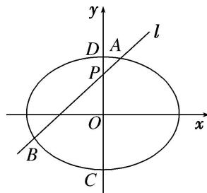

<!-- question-source:start -->
[例 4] (2015·四川)如图，椭圆 $E: \frac{x^{2}}{a^{2}} + \frac{y^{2}}{b^{2}} = 1 (a > b > 0)$ 的离心率是 $\frac{\sqrt{2}}{2}$ ，点 $P(0, 1)$ 在短轴 CD 上，且 $\overrightarrow{PC} \cdot \overrightarrow{PD} = -1$ .

(1)求椭圆 E 的标准方程;

(2)设 $O$ 为坐标原点，过点 $P$ 的动直线与椭圆交于 $A, B$ 两点．是否存在常数 $\lambda$ ，使得 $\overrightarrow{OA} \cdot \overrightarrow{OB} + \lambda \overrightarrow{PA} \cdot \overrightarrow{PB}$ 为定值？若存在，求 $\lambda$ 的值；若不存在，请说明理由.

(2)当直线 $AB$ 的斜率存在时，设直线 $AB$ 的方程为 $y = kx + 1$ ， $A$ ， $B$ 的坐标分别为 $(x_{1},y_{1})$ ， $(x_{2},y_{2})$ 联立 $\left\{ \begin{array}{l} \frac{x^2}{4} +\frac{y^2}{2} = 1,\\ y = kx + 1 \end{array} \right.$ 得 $(2k^{2} + 1)x^{2} + 4kx - 2 = 0$ ，其判别式 $\varDelta = (4k)^{2} + 8(2k^{2} + 1) > 0,$

所以 $x_{1} + x_{2} = -\frac{4k}{2k^{2} + 1}, x_{1}x_{2} = -\frac{2}{2k^{2} + 1}$ .

从而， $\overrightarrow{OA}\cdot\overrightarrow{OB}+\lambda\overrightarrow{PA}\cdot\overrightarrow{PB}=x_{1}x_{2}+y_{1}y_{2}+\lambda[x_{1}x_{2}+(y_{1}-1)(y_{2}-1)]=(1+\lambda)(1+k^{2})x_{1}x_{2}+k(x_{1}+x_{2})+1=\frac{(-2\lambda-4)k^{2}+(-2\lambda-1)}{2k^{2}+1}=-\frac{\lambda-1}{2k^{2}+1}-\lambda-2$ ，所以，

当 $\lambda = 1$ 时， $-\frac{\lambda - 1}{2k^2 + 1} -\lambda - 2 = -3$ ，此时， $\overrightarrow{OA} \cdot \overrightarrow{OB} + \lambda \overrightarrow{PA} \cdot \overrightarrow{PB} = -3$ 为定值.

当直线 AB 斜率不存在时，直线 AB 即为直线 CD，

此时， $\overrightarrow{OA}\cdot \overrightarrow{OB} +\lambda \overrightarrow{PA}\cdot \overrightarrow{PB} = \overrightarrow{OC}\cdot \overrightarrow{OD} +\lambda \overrightarrow{PC}\cdot \overrightarrow{PD} = -2 - \lambda .$

当 $\lambda=1$ 时， $\overrightarrow{OA}\cdot\overrightarrow{OB}+\lambda\overrightarrow{PA}\cdot\overrightarrow{PB}=-3$ ，为定值.

综上，存在常数 $\lambda=1$ ，使得 $\overrightarrow{OA}\cdot\overrightarrow{OB}+\lambda\overrightarrow{PA}\cdot\overrightarrow{PB}$ 为定值-3.
<!-- question-source:end -->

![[高中/总复习/专题/圆锥曲线/专题32  探究是否存在常数型问题-圆锥曲线/专题32_探究是否存在常数型问题/例题选讲/例题/answers/Q00032751A1.md]]
