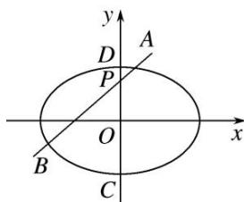

<!-- question-source:start -->
4. 如图，椭圆 $E: \frac{x^2}{a^2} + \frac{y^2}{b^2} = 1 (a > b > 0)$ 的离心率是 $\frac{\sqrt{3}}{2}$ ，点 $P(0, 1)$ 在短轴 $CD$ 上，且 $\overrightarrow{PC} \cdot \overrightarrow{PD} = -1$ .

(1)求椭圆 E 的方程;

(2)设 O 为坐标原点，过点 P 的动直线与椭圆交于 A, B 两点．是否存在常数 $\lambda$ ，使得 $\overrightarrow{OA} \cdot \overrightarrow{OB} + \lambda \overrightarrow{PA} \cdot \overrightarrow{PB}$ 为定值？若存在，求出 $\lambda$ 的值；若不存在，请说明理由.

<!-- question-source:end -->

![[高中/总复习/专题/圆锥曲线/专题32  探究是否存在常数型问题-圆锥曲线/专题32_探究是否存在常数型问题/对点训练/题目/answers/Q00032757A1.md]]
