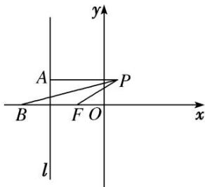

> [!faq]- 《专题33  探究是否存在点型问题-圆锥曲线》例题解析
>
> > [!success]- **【答案】** 详见解析
>
> > [!note]- **【分析】**
> > 本题未单列分析。
>
> > [!note]- **【解析】**
> > (1)求动点 P 的轨迹 C 的方程;
> > (2)过点 $F$ 的直线 $q$ 交曲线 $C$ 于 $M, N$ , 试问: $x$ 轴正半轴上是否存在点 $E$ , 直线 $EM, EN$ 分别交直线 $l$ 于 $R, S$ 两点, 使 $\angle RFS$ 为直角? 若存在, 求出点 $E$ 的坐标; 若不存在, 请说明理由.
> > 
> > 4. 解析
> > (1) 设 $P(x, y)$ ，由平面几何知识得 $\frac{|PF|}{|PA|} = \frac{\sqrt{2}}{2}$ ，即 $\frac{\sqrt{x + 1 - 2 + y^{2}}}{|x + 2|} = \frac{\sqrt{2}}{2}$ ，化简得 $\frac{x^{2}}{2} + y^{2} = 1$ ，
> > 所以动点 P 的轨迹 C 的方程为 $\frac{x^{2}}{2} + y^{2} = 1 (x \neq \sqrt{2})$ .
> > (2)假设满足条件的点 $E(n, 0)(n>0)$ 存在，设直线 q 的方程为 x=my-1，
> > $M(x_{1},y_{1}),N(x_{2},y_{2}),R(-2,y_{3}),S(-2,y_{4}).$ 联立 $\left\{ \begin{array}{l}x^{2} + 2y^{2} = 2,\\ x = my - 1, \end{array} \right.$ 消去 $x$ ，得 $(m^2 +2)y^2 -2my - 1 = 0,$
> > $$
> > y _ {1} + y _ {2} = \frac {2 m}{m ^ {2} + 2}, y _ {1} y _ {2} = - \frac {1}{m ^ {2} + 2},
> > $$
> > $$
> > x _ {1} x _ {2} = \left(m y _ {1} - 1\right) \left(m y _ {2} - 1\right) = m ^ {2} y _ {1} y _ {2} - m \left(y _ {1} + y _ {2}\right) + 1 = - \frac {m ^ {2}}{m ^ {2} + 2} - \frac {2 m ^ {2}}{m ^ {2} + 2} + 1 = \frac {2 - 2 m ^ {2}}{m ^ {2} + 2},
> > $$
> > $$
> > x _ {1} + x _ {2} = m \left(y _ {1} + y _ {2}\right) - 2 = \frac {2 m ^ {2}}{m ^ {2} + 2} - 2 = - \frac {4}{m ^ {2} + 2},
> > $$
> > 由条件知 $\frac{y_{1}}{x_{1}-n}=\frac{y_{3}}{-2-n},\quad y_{3}=-\frac{2+n}{x_{1}-n}y_{1}$ ，同理 $y_{4}=-\frac{2+n}{x_{2}-n}y_{2},\quad k_{RF}=\frac{y_{3}}{-2+1}=-y_{3},\quad k_{SF}=-y_{4}.$
> > 因为 $\angle RFS$ 为直角，所以 $y_{3}y_{4} = -1$ ，所以 $(2 + n)^{2}y_{1}y_{2} = -[x_{1}x_{2} - n(x_{1} + x_{2}) + n^{2}]$ ，
> > $(2+n)^{2}\frac{1}{m^{2}+2}=\frac{2-2m^{2}}{m^{2}+2}+\frac{4n}{m^{2}+2}+n^{2}$ ，所以 $(n^{2}-2)(m^{2}+1)=0,\quad n=\sqrt{2}$
> > 故满足条件的点 E 存在，其坐标为 $(\sqrt{2}, 0)$ .
