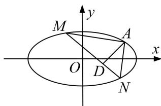

<!-- question-source:start -->
[例 1] (2020·新高考I)已知椭圆 C: $\frac{x^{2}}{a^{2}}+\frac{y^{2}}{b^{2}}=1(a>b>0)$ 的离心率为 $\frac{\sqrt{2}}{2}$ ，且过点 A(2, 1).

(1)求 $C$ 的方程;

(2)点 M, N 在 C 上，且 $AM \perp AN$ , $AD \perp MN$ , D 为垂足．证明：存在定点 Q，使得 $|DQ|$ 为定值.

(2)设 $M(x_{1}, y_{1})$ ， $N(x_{2}, y_{2})$ 。若直线 MN 与 x 轴不垂直，

设直线 MN 的方程为 $y=kx+m$ ，代入 $\frac{x^{2}}{6}+\frac{y^{2}}{3}=1$ ，得 $(1+2k^{2})x^{2}+4kmx+2m^{2}-6=0$ .

于是 $x_{1} + x_{2} = -\frac{4km}{1 + 2k^{2}}, x_{1}x_{2} = \frac{2m^{2} - 6}{1 + 2k^{2}}.$ ①

由 $AM \perp AN$ ，得 $\overrightarrow{AM} \cdot \overrightarrow{AN} = 0$ ，故 $(x_{1}-2)(x_{2}-2) + (y_{1}-1)(y_{2}-1) = 0$ ，

整理得 $(k^{2} + 1)x_{1}x_{2} + (km - k - 2)(x_{1} + x_{2}) + (m - 1)^{2} + 4 = 0.$

将①代入上式，可得 $(k^{2} + 1)\frac{2m^{2} - 6}{1 + 2k^{2}} -(km - k - 2)\cdot \frac{4km}{1 + 2k^{2}} +(m - 1)^{2} + 4 = 0,$

整理得 $(2k+3m+1)(2k+m-1)=0$ .

因为 $A(2,1)$ 不在直线 MN 上，所以 $2k+m-1\neq0$ ，所以 $2k+3m+1=0$ ， $k\neq1$ 。

所以直线 MN 的方程为 $y=k\left(x-\frac{2}{3}\right)-\frac{1}{3}(k\neq1)$ . 所以直线 MN 过点 $P\left(\frac{2}{3}, -\frac{1}{3}\right)$ .

若直线 MN 与 x 轴垂直，可得 $N(x_{1}, -y_{1})$ 。由 $\overrightarrow{AM} \cdot \overrightarrow{AN} = 0$ ，得 $(x_{1} - 2)(x_{1} - 2) + (y_{1} - 1)(-y_{1} - 1) = 0$ 。

又 $\frac{x_{1}^{2}}{6}+\frac{y_{1}^{2}}{3}=1$ ，所以 $3x_{1}^{2}-8x_{1}+4=0$ 。解得 $x_{1}=2$ （舍去）， $x_{1}=\frac{2}{3}$ 。此时直线MN过点 $P\left(\frac{2}{3},-\frac{1}{3}\right)$ 。

令 Q 为 AP 的中点，即 $Q\left(\frac{4}{3}, \frac{1}{3}\right)$ .

若 D 与 P 不重合，则由题设知 AP 是 Rt△ADP 的斜边，故 $|DQ|=\frac{1}{2}|AP|=\frac{2\sqrt{2}}{3}$ .

若 D 与 P 重合，则 $|DQ|=\frac{1}{2}|AP|$ .

综上，存在点 $Q\left(\frac{4}{3},\frac{1}{3}\right)$ ，使得 $|DQ|$ 为定值.
<!-- question-source:end -->

![[高中/总复习/专题/圆锥曲线/专题33  探究是否存在点型问题-圆锥曲线/专题33_探究是否存在点型问题/例题选讲/例题/answers/Q00032760A1.md]]
