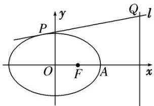

<!-- question-source:start -->
[例 3] 已知椭圆 C: $\frac{x^{2}}{a^{2}}+\frac{y^{2}}{b^{2}}=1(a>b>0)$ 的右焦点为 $F(1,0)$ ，右顶点为 A，且 $|AF|=1$ .

(1)求椭圆 C 的标准方程;

(2)若动直线 $l: y = kx + m$ 与椭圆 $C$ 有且只有一个交点 $P$ , 且与直线 $x = 4$ 交于点 $Q$ , 问: 是否存在一个定点 $M(t, 0)$ , 使得 $\overrightarrow{MP} \cdot \overrightarrow{MQ} = 0$ ? 若存在, 求出点 $M$ 的坐标; 若不存在, 说明理由.

(2)由 $\left\{\begin{aligned}y&=kx+m,\\ \frac{x^{2}}{4}&+\frac{y^{2}}{3}=1,\end{aligned}\right.$ 消去 y 得 $(3+4k^{2})x^{2}+8kmx+4m^{2}-12=0,$

$\therefore \Delta = 64k^{2}m^{2} - 4(3 + 4k^{2})(4m^{2} - 12) = 0$ ，即 $m^2 = 3 + 4k^2$

设 $P(x_{0}, y_{0})$ ，则 $x_{0} = -\frac{4km}{3 + 4k^{2}} = -\frac{4k}{m}$ ， $y_{0} = kx_{0} + m = -\frac{4k^{2}}{m} + m = \frac{3}{m}$ ，即 $P\left(-\frac{4k}{m}, \frac{3}{m}\right)$ .

$\because M(t, 0), Q(4, 4k+m), \therefore \overrightarrow{MP} = \left(-\frac{4k}{m} - t, \frac{3}{m}\right), \overrightarrow{MQ} = (4-t, 4k+m),$

$\therefore \overrightarrow{MP} \cdot \overrightarrow{MQ} = \left(-\frac{4k}{m} - t\right) \cdot (4 - t) + \frac{3}{m} \cdot (4k + m) = t^2 - 4t + 3 + \frac{4k}{m} (t - 1) = 0$ 恒成立，

故 $\left\{\begin{aligned}t-1&=0,\\ t^{2}-4t+3&=0,\end{aligned}\right.$ 即 t=1．∴存在点 M(1,0) 符合题意.
<!-- question-source:end -->

![[高中/总复习/专题/圆锥曲线/专题33  探究是否存在点型问题-圆锥曲线/专题33_探究是否存在点型问题/例题选讲/例题/answers/Q00032762A1.md]]
