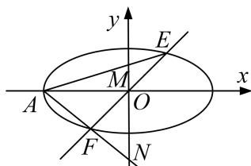

<!-- question-source:start -->
[例 4] 已知椭圆 C: $\frac{x^{2}}{a^{2}}+\frac{y^{2}}{b^{2}}=1(a>b>0)$ 的左顶点为 A，右焦点为 $F_{2}(2,0)$ ，点 $B(2,-\sqrt{2})$ 在椭圆 C 上.

(1)求椭圆 C 的方程.

(2)若直线 $y = kx (k \neq 0)$ 与椭圆 $C$ 交于 $E, F$ 两点，直线 $AE, AF$ 分别与 $y$ 轴交于点 $M, N$ 。在 $x$ 轴上，是否存在点 $P$ ，使得无论非零实数 $k$ 怎样变化，总有 $\angle MPN$ 为直角？若存在，求出点 $P$ 的坐标；若不存在，请说明理由。

(2)假设存在这样的点 P，设 $P(x_{0}, 0)$ ， $E(x_{1}, y_{1})$ ， $x_{1} > 0$ ，则 $F(-x_{1}, -y_{1})$ ， $\left\{\begin{aligned}y &= kx, \\ \frac{x^{2}}{8} + \frac{y^{2}}{4} &= 1,\end{aligned}\right.$

消去 $y$ 并化简得， $(1 + 2k^{2})\cdot x^{2} - 8 = 0$ ，解得 $x_{1} = \frac{2\sqrt{2}}{\sqrt{1 + 2k^{2}}}$ ，则 $y_{1} = \frac{2\sqrt{2}k}{\sqrt{1 + 2k^{2}}}$ 又 $A(-2\sqrt{2},0)$

∴AE所在直线的方程为 $y = \frac{k}{1 + \sqrt{1 + 2k^2}} (x + 2\sqrt{2}),\quad \therefore M\left(0,\frac{2\sqrt{2}k}{1 + \sqrt{1 + 2k^2}}\right),$

同理可得 $N\left\{0, \frac{2\sqrt{2}k}{1-\sqrt{1+2k^{2}}}\right\}$ ,

$$
\overrightarrow {P M} = \left[ - x _ {0}, \frac {2 \sqrt {2} k}{1 + \sqrt {1 + 2 k ^ {2}}} \right], \overrightarrow {P N} = \left[ - x _ {0}, \frac {2 \sqrt {2} k}{1 - \sqrt {1 + 2 k ^ {2}}} \right].
$$

若 $\angle MPN$ 为直角，则 $\overrightarrow{PM} \cdot \overrightarrow{PN} = 0, \therefore x_0^2 - 4 = 0,$

∴ $x_{0}=2$ 或 $x_{0}=-2$ ，∴ 存在点 P，使得无论非零实数 k 怎样变化，总有 $\angle MPN$ 为直角，

此时点 P 的坐标为 $(2, 0)$ 或 $(-2, 0)$ .
<!-- question-source:end -->

![[高中/总复习/专题/圆锥曲线/专题33  探究是否存在点型问题-圆锥曲线/专题33_探究是否存在点型问题/例题选讲/例题/answers/Q00032763A1.md]]
