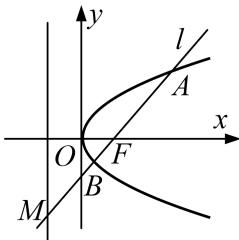

<!-- question-source:start -->
[例 9] 已知 F 为抛物线 C: $y^{2}=2px(p>0)$ 的焦点，过 F 的动直线交抛物线 C 于 A, B 两点．当直线与 x 轴垂直时， $|AB|=4$ .

(1)求抛物线 C 的方程;

(2)若直线 $AB$ 与抛物线的准线 $l$ 相交于点 $M$ , 在抛物线 $C$ 上是否存在点 $P$ , 使得直线 $PA, PM, PB$ 的斜率成等差数列? 若存在, 求出点 $P$ 的坐标; 若不存在, 说明理由.

(2)不妨设直线 AB 的方程为 $x=my+1(m\neq0)$ ,

因为抛物线 $y^{2}=4x$ 的准线方程为 x=-1，所以 $M\left(-1, -\frac{2}{m}\right)$ .

联立 $\left\{\begin{aligned}y^{2}&=4x,\\ x&=my+1\end{aligned}\right.$ 消去x，得 $y^{2}-4my-4=0$ ，

$\Delta=16m^{2}+16>0$ 恒成立，设 $A(x_{1},y_{1})$ ， $B(x_{2},y_{2})$ ，则 $y_{1}+y_{2}=4m$ ， $y_{1}y_{2}=-4$ ，

若存在定点 $P(x_{0}, y_{0})$ 满足条件，则 $2k_{PM} = k_{PA} + k_{PB}$ ，即 $2\frac{y_{0} + \frac{2}{m}}{x_{0} + 1} = \frac{y_{0} - y_{1}}{x_{0} - x_{1}} + \frac{y_{0} - y_{2}}{x_{0} - x_{2}}$ ,

因为点 P, A, B 均在抛物线上，所以 $x_{0}=\frac{y_{0}^{2}}{4}$ ， $x_{1}=\frac{y_{1}^{2}}{4}$ ， $x_{2}=\frac{y_{2}^{2}}{4}$ .

代入化简可得 $\frac{2}{m}\frac{my_{0}+2}{y_{0}^{2}+4}=\frac{2y_{0}+y_{1}+y_{2}}{y_{0}^{2}+y_{1}+y_{2}y_{0}+y_{1}y_{2}}$ ，将 $y_{1}+y_{2}=4m,\quad y_{1}y_{2}=-4$ 代入整理可得 $\frac{my_{0}+2}{m\quad y_{0}^{2}+4}=\frac{y_{0}+2m}{y_{0}^{2}+4my_{0}-4},$ 即 $(m^{2}+1)(y_{0}^{2}-4)=0,$

因为上式对 $\forall m \neq 0$ 恒成立，所以 $y_0^2 - 4 = 0$ ，解得 $y_0 = \pm 2$ ，将 $y_0 = \pm 2$ 代入抛物线方程，可得 $x_0 = 1$ 所以在抛物线 $C$ 上存在点 $P(1, \pm 2)$ ，使直线 $PA, PM, PB$ 的斜率成等差数列.
<!-- question-source:end -->

![[高中/总复习/专题/圆锥曲线/专题33  探究是否存在点型问题-圆锥曲线/专题33_探究是否存在点型问题/例题选讲/例题/answers/Q00032768A1.md]]
