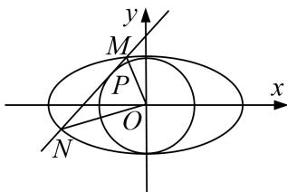

<!-- question-source:start -->
3. 已知椭圆 $C: \frac{x^2}{a^2} + \frac{y^2}{b^2} = 1 (a > b > 0)$ 的离心率为 $\frac{1}{2}$ , 点 $F$ 为左焦点, 过点 $F$ 作 $x$ 轴的垂线交椭圆 $C$ 于 $A$ , $B$ 两点, 且 $|AB| = 3$ .

(1)求椭圆 C 的方程;

(2)在圆 $x^{2} + y^{2} = 3$ 上是否存在一点 $P$ , 使得在点 $P$ 处的切线 $l$ 与椭圆 $C$ 相交于 $M, N$ 两点, 且满足 $\overrightarrow{OM} \perp \overrightarrow{ON}$ ? 若存在, 求 $l$ 的方程; 若不存在, 请说明理由.

<!-- question-source:end -->

![[高中/总复习/专题/圆锥曲线/专题33  探究是否存在点型问题-圆锥曲线/专题33_探究是否存在点型问题/对点训练/题目/answers/Q00032772A1.md]]
