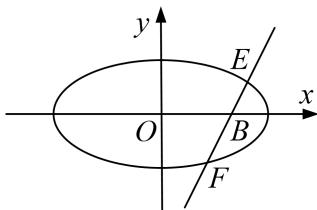

<!-- question-source:start -->
11. 设椭圆 $M: \frac{x^2}{a^2} + \frac{y^2}{b^2} = 1 (a > b > 0)$ 的左、右焦点分别为 $A(-1, 0), B(1, 0), C$ 为椭圆 $M$ 上的点，且 $\angle ACB = \frac{\pi}{3}, S_{\triangle ABC} = \frac{\sqrt{3}}{3}$ .

(1)求椭圆 M 的标准方程;

(2)设过椭圆 M 右焦点且斜率为 k 的动直线与椭圆 M 相交于 E, F 两点, 探究在 x 轴上是否存在定点 D, 使得 $\overrightarrow{DE} \cdot \overrightarrow{DF}$ 为定值? 若存在, 试求出定值和点 D 的坐标; 若不存在, 请说明理由.

<!-- question-source:end -->

![[高中/总复习/专题/圆锥曲线/专题33  探究是否存在点型问题-圆锥曲线/专题33_探究是否存在点型问题/对点训练/题目/answers/Q00032780A1.md]]
