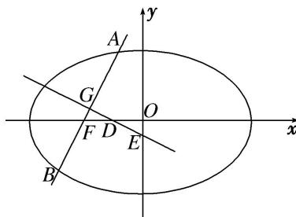

<!-- question-source:start -->
[例6] 椭圆 $\frac{x^2}{4} + \frac{y^2}{3} = 1$ 的左焦点为 $F$ ，过点 $F$ 的直线交椭圆于 $A$ ， $B$ 两点，线段 $AB$ 的中点为 $G$ ， $AB$ 的中垂线与 $x$ 轴和 $y$ 轴分别交于 $D$ ， $E$ 两点.

(1)若点 G 的横坐标为 $-\frac{1}{4}$ ，求直线 AB 的斜率；

(2)记 $\triangle GFD$ 的面积为 $S_{1}$ ， $\triangle OED(O$ 为原点)的面积为 $S_{2}$ ，试问：是否存在直线 $AB$ ，使得 $S_{1} = S_{2}$ ？说明理由.

[规范解答]
(1)由条件可得 $c^{2}=a^{2}-b^{2}=1$ ，故 F 点坐标为 $(-1,0)$ .

依题意可知，直线 AB 的斜率存在，设其方程为 $y=k(x+1)$ ，将其代入 $\frac{x^{2}}{4}+\frac{y^{2}}{3}=1$ ，

整理得 $(4k^{2}+3)x^{2}+8k^{2}x+4k^{2}-12=0.$

设 $A(x_{1},y_{1})$ ， $B(x_{2},y_{2})$ ，所以 $x_{1} + x_{2} = \frac{-8k^{2}}{4k^{2} + 3}$ 故点 $G$ 的横坐标为 $\frac{x_1 + x_2}{2} = \frac{-4k^2}{4k^2 + 3} = -\frac{1}{4},$
<!-- question-source:end -->

![[高中/总复习/专题/圆锥曲线/专题34  探究是否存在直线型问题-圆锥曲线/专题34__探究是否存在直线型问题/例题/answers/Q00042738A1.md]]
