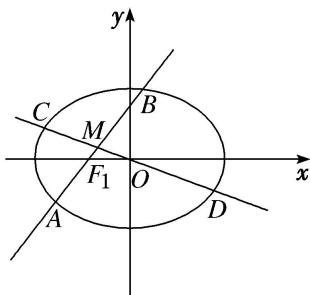

<!-- question-source:start -->
[例5] 如图所示，已知椭圆 $G: \frac{x^2}{2} + y^2 = 1$ ，与 $x$ 轴不重合的直线 $l$ 经过左焦点 $F_1$ ，且与椭圆 $G$ 相交于 $A, B$ 两点，弦 $AB$ 的中点为 $M$ ，直线 $OM$ 与椭圆 $G$ 相交于 $C, D$ 两点.

(1)若直线 l 的斜率为 1，求直线 OM 的斜率.

(2)是否存在直线 l，使得 $\left|AM\right|^{2}=\left|CM\right|\left|DM\right|$ 成立？若存在，求出直线 l 的方程；若不存在，请说明理由.

(2)假设存在直线 l，使得 $\left|AM\right|^{2}=\left|CM\right|\left|DM\right|$ 成立．由题意，直线 l 不与 x 轴重合，设直线 l 的方程为 x=my-1. 由 $\left\{\begin{aligned}x&=my-1,\\ \frac{x^{2}}{2}&+y^{2}=1,\end{aligned}\right.$ 消去 x 并整理得 $(m^{2}+2)y^{2}-2my-1=0$ .
设点 $A(x_{1}, y_{1}), B(x_{2}, y_{2})$ ，则 $\left\{\begin{aligned}y_{1}+y_{2}&=\frac{2m}{m^{2}+2},\\ y_{1}y_{2}&=-\frac{1}{m^{2}+2},\end{aligned}\right.$ 可得 $|AB|=\sqrt{1+m^{2}}|y_{1}-y_{2}|=\sqrt{1+m^{2}}\sqrt{\left(\frac{2m}{m^{2}+2}\right)^{2}+\frac{4}{m^{2}+2}}=\frac{2\sqrt{2}(m^{2}+1)}{m^{2}+2}$ $x_{1}+x_{2}=m(y_{1}+y_{2})-2=\frac{2m^{2}}{m^{2}+2}-2=\frac{-4}{m^{2}+2}$ 所以弦 AB 的中点 M 的坐标为 $\left(\frac{-2}{m^{2}+2}, \frac{m}{m^{2}+2}\right)$ ,
故直线 CD 的方程为 $y=-\frac{m}{2}x$ . 联立 $\left\{\begin{aligned}y&=-\frac{m}{2}x,\\ \frac{x^{2}}{2}&+y^{2}=1,\end{aligned}\right.$ 消去 y 并整理得 $2x^{2}+m^{2}x^{2}-4=0$ 解得 $x^{2}=\frac{4}{m^{2}+2}$ . 由对称性，设 $C(x_{0}, y_{0})$ , $D(-x_{0}, -y_{0})$ , 则 $x_{0}^{2}=\frac{4}{m^{2}+2}$ 可得 $|CD|=\sqrt{1+\frac{m^{2}}{4}}\cdot|2x_{0}|=\sqrt{(m^{2}+4)\frac{4}{m^{2}+2}}=2\sqrt{\frac{m^{2}+4}{m^{2}+2}}$ .
因为 $|AM|^{2}=|CM||DM|=(|OC|-|OM|)(|OD|+|OM|)$ ，且 $|OC|=|OD|$ ，所以 $|AM|^{2}=|OC|^{2}-|OM|^{2}$ ，故 $\frac{|AB|^2}{4}=\frac{|CD|^2}{4}-|OM|^2$ ，即 $|AB|^2=|CD|^2-4|OM|^2$ ，
则 $\frac{8(m^{2}+1)^{2}}{(m^{2}+2)^{2}}=\frac{4(m^{2}+4)}{m^{2}+2}-4\left[\frac{4}{(m^{2}+2)^{2}}+\frac{m^{2}}{(m^{2}+2)^{2}}\right]$ ，解得 $m^{2}=2$ ，故 $m=\pm\sqrt{2}$ .
所以直线 l 的方程为 $x-\sqrt{2}y+1=0$ 或 $x+\sqrt{2}y+1=0$ .

[题后悟通] 本题(2)的核心在于转化 $|AM|^{2}=|CM|\cdot|DM|$ 中弦长的关系. 由 $|CM|=|OC|-|OM|$ ， $|DM|=|OD|+|OM|$ ，又 $|OC|=|OD|$ ，得 $|AM|^{2}=|OC|^{2}-|OM|^{2}$ . 又 $|AM|=\frac{1}{2}|AB|$ ， $|OC|=\frac{1}{2}|CD|$ ，因此 $|AB|^{2}=|CD|^{2}-4|OM|^{2}$ ，转化为弦长 $|AB|$ ， $|CD|$ 和 $|OM|$ 三者之间的数量关系，易计算.
<!-- question-source:end -->

![[高中/总复习/专题/圆锥曲线/专题34  探究是否存在直线型问题-圆锥曲线/专题34_探究是否存在直线型问题/例题选讲/例题/answers/Q00032785A1.md]]
