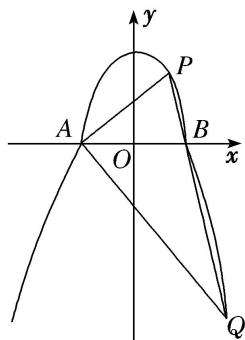

> [!faq]- 教师版例题解析
>
> > [!success]- **【答案】** 详见解析
>
> > [!note]- **【分析】**
> > 本题未单列分析。
>
> > [!note]- **【解析】**
> > [规范解答] (1) 在 $C_{2}$ 的方程中，令 y=0，可得 b=1.
> > 
> > 且 $A(-1,0), B(1,0)$ 是上半椭圆 $C_1$ 的左、右顶点．设 $C_1$ 的半焦距为 $c$ ，由 $\frac{c}{a} = \frac{\sqrt{3}}{2}$ 及 $a^2 - c^2 = b^2 = 1$ 可得 $a = 2$ ， $\therefore a = 2$ ， $b = 1$ 。
