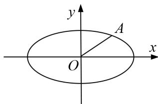

<!-- question-source:start -->
1. 已知中心在坐标原点 $O$ 的椭圆 $C$ 经过点 $A(2,3)$ , 且点 $F(2,0)$ 为其右焦点.

(1)求椭圆 C 的方程;

(2)是否存在平行于 $OA$ 的直线 $l$ , 使得直线 $l$ 与椭圆 $C$ 有公共点, 且直线 $OA$ 与 $l$ 的距离等于 4? 若存在, 求出直线 $l$ 的方程; 若不存在, 请说明理由.

<!-- question-source:end -->

![[高中/总复习/专题/圆锥曲线/专题34  探究是否存在直线型问题-圆锥曲线/专题34_探究是否存在直线型问题/对点训练/题目/answers/Q00032788A1.md]]
