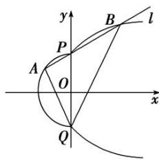

<!-- question-source:start -->
3. 如图，由部分抛物线 $y^{2} = mx + 1 (m > 0, x \geq 0)$ 和半圆 $x^{2} + y^{2} = r^{2} (x \leq 0)$ 所组成的曲线称为“黄金抛物线 $C$ ”，若“黄金抛物线 $C$ ”经过点(3, 2)和 $(-\frac{1}{2}, \frac{\sqrt{3}}{2})$ .

(1)求“黄金抛物线 C”的方程;

(2)设 $P(0, 1)$ 和 $Q(0, -1)$ ，过点 $P$ 作直线 $l$ 与“黄金抛物线 $C$ ”交于 $A, P, B$ 三点，问是否存在这样的直线 $l$ ，使得 $QP$ 平分 $\angle AQB$ ？若存在，求出直线 $l$ 的方程；若不存在，请说明理由。

<!-- question-source:end -->

![[高中/总复习/专题/圆锥曲线/专题34  探究是否存在直线型问题-圆锥曲线/专题34_探究是否存在直线型问题/对点训练/题目/answers/Q00032790A1.md]]
