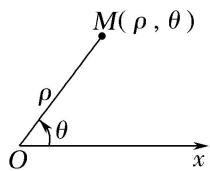
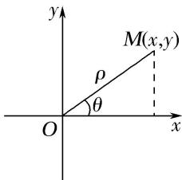
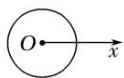
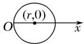
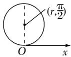
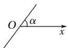

<!-- source-part:1 pages:1-11 -->

# 专题一 极坐标方程及其应用(综合型)

## 1. 极坐标系

如图
(1)所示，在平面内取一个定点 O，叫做极点；自极点 O 引一条射线 Ox，叫做极轴；再选定一个长度单位、一个角度单位(通常取弧度)及其正方向(通常取逆时针方向)，这样就建立了一个极坐标系.

## 2. 极坐标

①极径：设 M 是平面内一点，极点 O 与点 M 的距离 $|OM|$ 叫做点 M 的极径，记为 $\rho$ .

②极角：以极轴 Ox 为始边，射线 OM 为终边的角 xOM 叫做点 M 的极角，记为 $\theta$ .

③极坐标: 有序数对 $(\rho, \theta)$ 叫做点 $M$ 的极坐标, 记为 $M(\rho, \theta)$ , 一般不作特殊说明时, 我们认为 $\rho \geq 0$ , $\theta$ 可取任意实数. 当极角 $\theta$ 的取值范围是 $[0, 2\pi)$ 时, 平面上的点(除去极点)就与极坐标 $(\rho, \theta)(\rho \neq 0)$ 建立一一对应的关系. 我们设定, 极点的极坐标中, 极径 $\rho = 0$ , 极角 $\theta$ 可取任意角.

  
图
(1)

  
图
(2)

## 3. 极坐标与直角坐标的互化

设 M 为平面上的一点，它的直角坐标为 $(x, y)$ ，极坐标为 $(\rho, \theta)$ 。由图
(2)可知下面的关系式成立： $\left\{\begin{aligned}x&=\rho\cos\theta,\\ y&=\rho\sin\theta\end{aligned}\right.$ 或 $\left\{\begin{aligned}\rho^{2}&=x^{2}+y^{2},\\ \tan\theta&=\frac{y}{x}(x\neq0),\end{aligned}\right.$ 这就是极坐标与直角坐标的互化公式.

## 4. 常见曲线的极坐标方程

<table><tr><td>曲线</td><td>图形</td><td>极坐标方程</td></tr><tr><td>圆心在极点,半径为r的圆</td><td></td><td>ρ=r(0≤θ&lt;2π)</td></tr><tr><td>圆心为(r,0),半径为r的圆</td><td></td><td>ρ=2rcosθ(-π/2≤θ&lt;π/2)</td></tr><tr><td>圆心为(r,π/2),半径为r的圆</td><td></td><td>ρ=2rsinθ(0≤θ&lt;π)</td></tr><tr><td>过极点,倾斜角为α的直线</td><td></td><td>θ=α(ρ∈R)或θ=α+π(ρ∈R)</td></tr><tr><td>过点(a,0),与极轴垂直的直线</td><td>O (a,0)x</td><td>ρcosθ=a(-π/2&lt;θ&lt;π/2)</td></tr><tr><td>过点 $\left(a, \frac{\pi}{2}\right)$ ,与极轴平行的直线</td><td></td><td> $\rho\sin\theta = a(0<\theta<\pi)$ </td></tr></table>

## [微点提醒]

## 关于极坐标系

1. 极坐标系的四要素：①极点；②极轴；③长度单位；④角度单位和它的正方向，四者缺一不可.

2. 一般地，点 $M(\rho, \theta)$ 的极坐标通式是 $(\rho, \theta + 2k\pi)$ 或 $(- \rho, \theta + 2k\pi + \pi)(k \in \mathbf{Z})$ 。和直角坐标不同，平面内一个点的极坐标有无数种表示。

3. 极坐标与直角坐标的重要区别：多值性.

## 【例题选讲】

![[高中/总复习/专题/坐标系与参数方程（文理通用）/专题1 极坐标方程及其应用(综合型)-坐标系与参数方程（文理通用）/专题1_极坐标方程及其应用_综合型_/例题/Q00042748.md]]
![[高中/总复习/专题/坐标系与参数方程（文理通用）/专题1 极坐标方程及其应用(综合型)-坐标系与参数方程（文理通用）/专题1_极坐标方程及其应用_综合型_/例题/Q00042749.md]]
![[高中/总复习/专题/坐标系与参数方程（文理通用）/专题1 极坐标方程及其应用(综合型)-坐标系与参数方程（文理通用）/专题1_极坐标方程及其应用_综合型_/例题/Q00042750.md]]
![[高中/总复习/专题/坐标系与参数方程（文理通用）/专题1 极坐标方程及其应用(综合型)-坐标系与参数方程（文理通用）/专题1_极坐标方程及其应用_综合型_/例题/Q00042751.md]]
![[高中/总复习/专题/坐标系与参数方程（文理通用）/专题1 极坐标方程及其应用(综合型)-坐标系与参数方程（文理通用）/专题1_极坐标方程及其应用_综合型_/例题/Q00042752.md]]
![[高中/总复习/专题/坐标系与参数方程（文理通用）/专题1 极坐标方程及其应用(综合型)-坐标系与参数方程（文理通用）/专题1_极坐标方程及其应用_综合型_/例题/Q00042753.md]]
![[高中/总复习/专题/坐标系与参数方程（文理通用）/专题1 极坐标方程及其应用(综合型)-坐标系与参数方程（文理通用）/专题1_极坐标方程及其应用_综合型_/例题/Q00042754.md]]
![[高中/总复习/专题/坐标系与参数方程（文理通用）/专题1 极坐标方程及其应用(综合型)-坐标系与参数方程（文理通用）/专题1_极坐标方程及其应用_综合型_/例题/Q00042755.md]]
![[高中/总复习/专题/坐标系与参数方程（文理通用）/专题1 极坐标方程及其应用(综合型)-坐标系与参数方程（文理通用）/专题1_极坐标方程及其应用_综合型_/例题/Q00042756.md]]
![[高中/总复习/专题/坐标系与参数方程（文理通用）/专题1 极坐标方程及其应用(综合型)-坐标系与参数方程（文理通用）/专题1_极坐标方程及其应用_综合型_/例题/Q00042757.md]]
![[高中/总复习/专题/坐标系与参数方程（文理通用）/专题1 极坐标方程及其应用(综合型)-坐标系与参数方程（文理通用）/专题1_极坐标方程及其应用_综合型_/例题/Q00042758.md]]
![[高中/总复习/专题/坐标系与参数方程（文理通用）/专题1 极坐标方程及其应用(综合型)-坐标系与参数方程（文理通用）/专题1_极坐标方程及其应用_综合型_/例题/Q00042759.md]]
![[高中/总复习/专题/坐标系与参数方程（文理通用）/专题1 极坐标方程及其应用(综合型)-坐标系与参数方程（文理通用）/专题1_极坐标方程及其应用_综合型_/对点训练/Q00050907.md]]
![[高中/总复习/专题/坐标系与参数方程（文理通用）/专题1 极坐标方程及其应用(综合型)-坐标系与参数方程（文理通用）/专题1_极坐标方程及其应用_综合型_/对点训练/Q00050908.md]]
![[高中/总复习/专题/坐标系与参数方程（文理通用）/专题1 极坐标方程及其应用(综合型)-坐标系与参数方程（文理通用）/专题1_极坐标方程及其应用_综合型_/对点训练/Q00050909.md]]
![[高中/总复习/专题/坐标系与参数方程（文理通用）/专题1 极坐标方程及其应用(综合型)-坐标系与参数方程（文理通用）/专题1_极坐标方程及其应用_综合型_/对点训练/Q00042763.md]]
![[高中/总复习/专题/坐标系与参数方程（文理通用）/专题1 极坐标方程及其应用(综合型)-坐标系与参数方程（文理通用）/专题1_极坐标方程及其应用_综合型_/对点训练/Q00042764.md]]
![[高中/总复习/专题/坐标系与参数方程（文理通用）/专题1 极坐标方程及其应用(综合型)-坐标系与参数方程（文理通用）/专题1_极坐标方程及其应用_综合型_/对点训练/Q00042765.md]]
![[高中/总复习/专题/坐标系与参数方程（文理通用）/专题1 极坐标方程及其应用(综合型)-坐标系与参数方程（文理通用）/专题1_极坐标方程及其应用_综合型_/对点训练/Q00042766.md]]
![[高中/总复习/专题/坐标系与参数方程（文理通用）/专题1 极坐标方程及其应用(综合型)-坐标系与参数方程（文理通用）/专题1_极坐标方程及其应用_综合型_/对点训练/Q00042767.md]]
![[高中/总复习/专题/坐标系与参数方程（文理通用）/专题1 极坐标方程及其应用(综合型)-坐标系与参数方程（文理通用）/专题1_极坐标方程及其应用_综合型_/对点训练/Q00042768.md]]
![[高中/总复习/专题/坐标系与参数方程（文理通用）/专题1 极坐标方程及其应用(综合型)-坐标系与参数方程（文理通用）/专题1_极坐标方程及其应用_综合型_/对点训练/Q00042769.md]]
