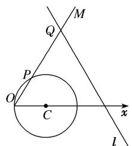

<!-- question-source:start -->
[例6] 在平面直角坐标系 $xOy$ 中，圆 $C$ 的参数方程为 $\left\{ \begin{array}{l} x = 1 + \cos \varphi, \\ y = \sin \varphi \end{array} \right.$ ( $\varphi$ 为参数)，以坐标原点 $O$ 为极点， $x$ 轴的正半轴为极轴建立极坐标系.

(1)求圆 C 的极坐标方程;

(2)直线 l 的极坐标方程是 $2\rho\sin\left(\theta+\frac{\pi}{3}\right)=3\sqrt{3}$ ，射线 OM: $\theta=\frac{\pi}{3}$ 与圆 C 的交点为 O, P，与直线 l 的交点为 Q，求线段 PQ 的长.

[规范解答]
(1)由圆 C 的参数方程为 $\left\{\begin{aligned} x &= 1 + \cos \varphi, \\ y &= \sin \varphi \end{aligned}\right.$ ( $\varphi$ 为参数),

可得圆 C 的直角坐标方程为 $(x-1)^{2}+y^{2}=1$ ，即 $x^{2}+y^{2}-2x=0$ .

由极坐标方程与直角坐标方程的互化公式可得，圆 C 的极坐标方程为 $\rho = 2\cos\theta$ .

(2)由 $\left\{\begin{aligned}\theta=\frac{\pi}{3},\\ \rho-2\cos\theta=0\end{aligned}\right.$ 得 $P\left(1,\frac{\pi}{3}\right)$ ，由 $\left\{\begin{aligned}\theta=\frac{\pi}{3},\\ 2\rho\sin\left(\theta+\frac{\pi}{3}\right)=3\sqrt{3}\end{aligned}\right.$ 得 $Q\left(3,\frac{\pi}{3}\right)$ ,

结合图可得 $|PQ|=|OQ|-|OP|=|\rho_{Q}|-|\rho_{P|=3-1=2.}$
<!-- question-source:end -->
